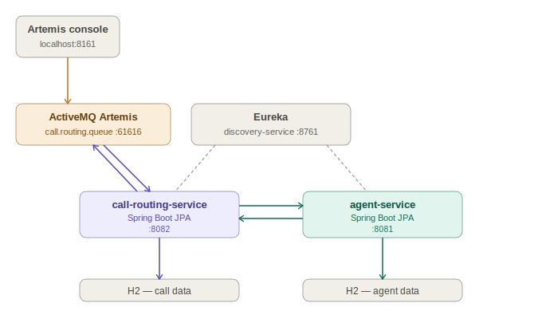

# RouteIQ — Call Routing Engine
## Project Specification

---

## Overview

RouteIQ simulates the operational backbone of a contact center. A call event arrives as a JMS XML message, is consumed by the routing service, matched to an available agent by call category, and the assignment is recorded. Agent status is managed manually via REST.

---

## Services

Three services. Build and run them as separate Spring Boot applications.

| Service | Responsibility | Port |
|---|---|---|
| `discovery-service` | Eureka server — all services register here | 8761 |
| `agent-service` | Owns agent data, exposes REST API | 8081 |
| `call-routing-service` | Consumes call events, runs routing logic, persists assignments | 8082 |



### Startup order

Start in dependency order. Each service fails fast if its dependencies are not running.

1. ActiveMQ Artemis broker (port 61616)
2. `discovery-service`
3. `agent-service`
4. `call-routing-service`

---

## Technology stack

Manage all Spring versions through the BOM — do not specify versions on individual starters.

- Java 21
- Spring Boot 3.3.x
- Spring Cloud 2023.0.x
- H2 in-memory database (development)
- ActiveMQ Artemis (`spring-boot-starter-artemis`)

### Required starters per service

**call-routing-service**
- `spring-boot-starter-artemis`
- `spring-boot-starter-web`
- `spring-boot-starter-data-jpa`
- `jackson-dataformat-xml`
- `h2` (runtime)
- `spring-cloud-starter-netflix-eureka-client`

**agent-service**
- `spring-boot-starter-web`
- `spring-boot-starter-data-jpa`
- `spring-boot-starter-actuator`
- `h2` (runtime)
- `spring-cloud-starter-netflix-eureka-client`

**discovery-service**
- `spring-cloud-starter-netflix-eureka-server`

---

## Project structure


```

  call-routing-service/
    pom.xml
    src/main/java/com/revature/routing/
      RoutingApplication.java
      listener/CallEventListener.java
      model/CallEvent.java
      service/RoutingService.java
      entity/InboundCall.java
      repository/InboundCallRepository.java
    src/main/resources/
      application.yml
  agent-service/
    pom.xml
    src/main/java/com/revature/agent/
      AgentApplication.java
      controller/AgentController.java
      entity/Agent.java
      entity/CallCategory.java
      entity/InboundCall.java
      repository/AgentRepository.java
      service/AgentService.java
    src/main/resources/
      application.yml
      data.sql
  discovery-service/
    pom.xml
    src/main/java/com/revature/discovery/
      DiscoveryApplication.java
    src/main/resources/
      application.yml
```

---

## Data model

Two entities. Both live in agent-service. call-routing-service references agents by ID via REST — it does not share the database.

### Agent

| Field | Type | Notes |
|---|---|---|
| id | Long | Primary key, auto-generated |
| name | String | Not null |
| email | String | Unique, not null |
| status | Enum | AVAILABLE, ON_CALL, WRAP_UP, OFFLINE |
| categories | Set\<CallCategory\> | `@ElementCollection` — call types this agent handles |

### CallCategory (enum)

```
BILLING, TECHNICAL, SALES, GENERAL
```

### InboundCall

| Field | Type | Notes |
|---|---|---|
| id | Long | Primary key, auto-generated |
| callId | String | UUID from the call event |
| callerNumber | String | |
| callCategory | Enum | CallCategory |
| assignedAgent | Agent | ManyToOne |
| receivedAt | LocalDateTime | Set on creation |
| status | Enum | ASSIGNED, COMPLETED, ABANDONED |

---

## Seed data

Load on startup via `data.sql`. Agents must cover all four CallCategory values with at least two AVAILABLE agents per category. Include at least one ON_CALL and one OFFLINE agent to make the availability query meaningful.

**Minimum seed set:** 5 agents with the following coverage —

| Agent | Categories | Status |
|---|---|---|
| Alice | TECHNICAL, GENERAL | AVAILABLE |
| Bob | BILLING, GENERAL | AVAILABLE |
| Carol | SALES, BILLING | AVAILABLE |
| David | TECHNICAL | ON_CALL |
| Eve | GENERAL | OFFLINE |

---

## JMS example message format

### Inbound XML

Published to queue: `call.routing.queue`

```xml
<?xml version="1.0" encoding="UTF-8"?>
<callEvent>
  <callId>10001</callId>
  <callCategory>TECHNICAL</callCategory>
  <callerNumber>+13125550182</callerNumber>
  <callerName>Jane Smith</callerName>
  <timestamp>2026-03-17T09:42:00Z</timestamp>
</callEvent>
```

Valid `callCategory` values: `BILLING`, `TECHNICAL`, `SALES`, `GENERAL`

Use the ActiveMQ Artemis web console at `http://localhost:8161` to publish test messages
during development. Default credentials: admin / admin.


---

## call-routing-service — what to implement

### CallEvent

A plain Java class that maps to the inbound XML. You can use JAXB or Jackson XML Binding to map and deserialize. With Jackson, use `@JacksonXmlRootElement` and`@JacksonXmlProperty` annotations, along with the `XmlMapper` to deserialize.

### CallEventListener

Annotate with `@JmsListener` to consume from `call.routing.queue`. On receipt, deserialize the XML string into a `CallEvent` and pass it to `RoutingService`. On any exception, log the error and do not rethrow — the service must keep processing.

### RoutingService

Core routing logic. For each valid `CallEvent`:

1. Parse `callCategory` to `CallCategory` enum — default to `GENERAL` if unrecognized
2. Query for an available agent 
3. If no agent found, log and return — do not throw
4. Persist an `InboundCall` record with the assigned agent, category, callId, and timestamp
5. Call agent-service via `RestTemplate` to update the agent's status to ON_CALL

Mark the method `@Transactional` — the persist and the status update must succeed or fail together.

### Configuration

Queue names and the agent-service URL must come from `application.yml` — do not hardcode.
All services must set `spring.application.name` and register with Eureka.

---

## agent-service — what to implement

### Agent entity

Map to the `AGENT` table. The `categories` field is an `@ElementCollection` of
`CallCategory` enum values stored in a separate `AGENT_CATEGORIES` table.


### AgentService

Implement the availability query using Spring Data JPA Specifications:
- `status` = AVAILABLE
- `categories` contains the requested category

### AgentController

Expose the following endpoints:

| Method | Path | Description |
|---|---|---|
| GET | /agents | All agents |
| GET | /agents/{id} | Single agent with categories |
| GET | /agents?status=AVAILABLE&category={category} | Available agents for a category |
| PUT | /agents/{id}/status | Update status — body: `{ "status": "ON_CALL" }` |
| GET | /agents/{id}/calls | InboundCall records for this agent |
| POST | /agents | Create agent (seeding and admin use) |

Return 404 if an agent is not found. Use `ResponseStatusException`.

---

## discovery-service — what to implement

Add `@EnableEurekaServer` to the main application class.

Configure in `application.yml`:
- Port: 8761
- `eureka.client.register-with-eureka: false`
- `eureka.client.fetch-registry: false`

No other logic required. The Eureka dashboard at `http://localhost:8761` shows all registered services.

---

## Agent status lifecycle

Status is **not** managed automatically in the base project. It changes only when `PUT /agents/{id}/status` is called explicitly.

After routing assigns a call, the agent is set to ON_CALL and stays ON_CALL until manually reset. During testing, reset agents to AVAILABLE between test messages.

Use `GET /agents` to check current agent statuses before publishing a new call event.

### Stretch goal — automatic status reset

Add a `@Scheduled` method to agent-service that periodically finds all `InboundCall`
records with status `ASSIGNED` and a `receivedAt` older than a configurable threshold,
marks them `COMPLETED`, and resets the assigned agent to `AVAILABLE`.

Key points:
- Add `@EnableScheduling` to `AgentApplication`
- Use `fixedDelayString` with a value from `application.yml` so the interval is configurable
- The threshold age should also be configurable
- Mark the method `@Transactional`

---

## Stretch goal ladder

The system works at every rung. Implement in order.

1. **Base** — call-routing-service + agent-service + Eureka + broker *(this spec)*
2. **Auto status reset** — `@Scheduled` job in agent-service (see above)
3. **Separate ingest service** — extract XML parsing into `call-ingest-service`; add a
   second queue (`call.ingest.raw`); ingest normalizes and forwards to `call.routing.queue`
4. **Config server** — add a `spring-cloud-config-server` service; move queue names,
   datasource URLs, and the broker URL out of `application.yml` into a local Git config repo
5. **API gateway** — add a `spring-cloud-starter-gateway` service routing `/api/agents/**`
   and `/api/calls/**` through Eureka using `lb://` prefixes
6. **Deadletter handling** — configure a proper DLQ in Artemis; add a listener that logs
   or persists failed messages for inspection

---

## Acceptance criteria

All of the following must work end-to-end:

- Publish a TECHNICAL call XML → `InboundCall` created, assigned to an AVAILABLE agent with TECHNICAL in categories
- Publish a BILLING call XML → assigned to an AVAILABLE agent with BILLING in categories
- Publish a call when no AVAILABLE agents handle that category → logged as unassigned, no `InboundCall` created, no exception
- Publish a call with unrecognized category → defaults to GENERAL, routed to a GENERAL agent
- Publish malformed XML → error logged, call-routing-service continues processing subsequent messages
- `GET /agents/available?category=TECHNICAL` → returns JSON array of matching available agents
- `GET /agents/{id}/calls` → returns list of `InboundCall` records for that agent
- `PUT /agents/{id}/status` with `WRAP_UP` → status updates, agent excluded from next routing query
- Restart call-routing-service while broker is running → re-registers with Eureka, resumes consuming, no messages lost
