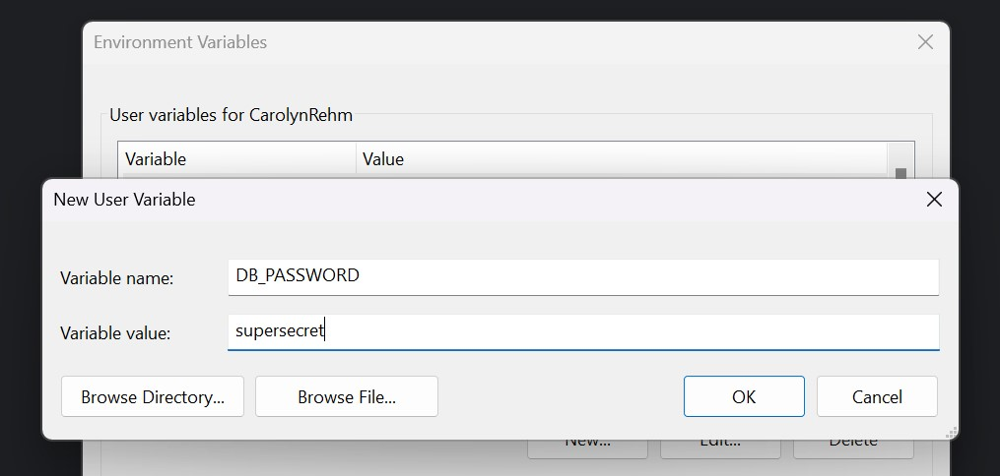
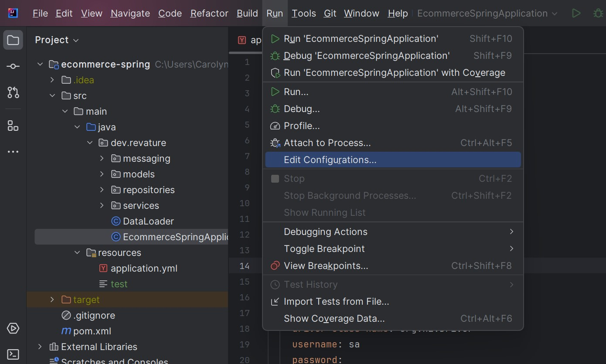
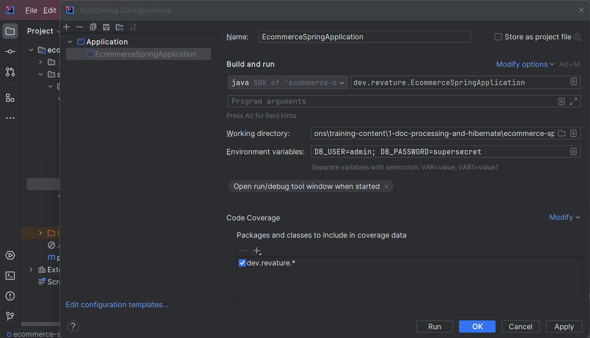

# Environment Variables in Spring Boot

## What Are Environment Variables

Environment variables are key-value pairs managed by your operating system, available to any process running on the machine. In the context of Spring Boot, they're the simplest way to keep secrets - database credentials, API keys, connection strings - out of your source code and off of GitHub.

Instead of this in `application.yml`:

```yml
spring:
  datasource:
    password: supersecretpassword
```

You write this:

```yml
spring:
  datasource:
    password: ${DB_PASSWORD}
```

Spring Boot resolves `${VAR_NAME}` from the environment automatically at startup. The actual value never appears in your codebase.

---

## Setting Environment Variables on Windows

### Option A — System-level (persistent, available everywhere)

Use this when you want the variable available to all projects and all terminals on your machine.

1. Open the Start menu and search for **"Edit the system environment variables"**
2. Click **Environment Variables...**
3. Under **User variables**, click **New**
4. Enter a name (e.g. `DB_PASSWORD`) and value
5. Click OK through all dialogs
6. **Restart any open terminals or IntelliJ** - existing processes won't pick up the change



Verify it's set by opening a new Command Prompt and running:

```cmd
echo %DB_PASSWORD%
```

or in git bash:

```bash
echo $DB_PASSWORD
```

### Option B — IntelliJ Run Configuration (project-scoped, no global changes)

Use this when the variable is specific to one project, or you're juggling multiple projects with different values for the same variable name.

1. Open **Run** → **Edit Configurations...**
2. Select your Spring Boot run configuration (named after your main class)
3. Find the **Environment variables** field
4. Click the browse icon to the right of the field
5. Click **+** and enter the variable name and value
6. Click **OK** to save






These variables are injected only when IntelliJ launches the app. They don't affect your terminal, other run configurations, or other projects.

> **Tip:** You can paste a semicolon-separated list directly into the environment variables field instead of using the dialog: `DB_USER=admin;DB_PASSWORD=secret;DB_URL=jdbc:postgresql://localhost:5432/mydb`

---

## Exercise — Securing the Ecommerce Application

### Goal

Take a Spring Boot application with hardcoded credentials in its config, remove them, replace them with environment variable references, and confirm the app still runs correctly.

### Setup

Pull the latest `ecommerce-spring` from our GitHub repo. Run it as-is and confirm it starts and connects to the database before making any changes.

### Steps

**1. Find the secrets.**

Open `application.yml` and identify every value that should not be visible in source control. You're looking for anything sensitive - database URL, username, password, and any API keys or tokens you spot. Make a note of each one and what you'll name its environment variable. Browse through the classes - are there any other values that you might want to reference using an environment variable?

**2. Replace them with placeholders.**

For each sensitive value, swap the hardcoded string for a `${VARIABLE_NAME}` reference. Stick to a clear naming convention: `DB_URL`, `DB_USER`, `DB_PASSWORD` works well. When you're done, your application source code should contain no credentials.

**3. Set the variables.**

Choose whichever option fits your setup:
- **System-level** — use the Windows environment variables dialog (Option A above)
- **IntelliJ run configuration** — use the environment variables field (Option B above)

**4. Run the app and verify.**

Start the application. It should start cleanly and connect to the database exactly as before. Test a few endpoints to confirm nothing broke.

**5. Check the config file one more time.**

Open `application.yml` and confirm no sensitive values appear anywhere in the file. If a classmate cloned your repo right now, they would have no credentials and the app would refuse to start without setting the variables themselves.

### Discussion

If a teammate cloned the repo and tried to run the app without setting the environment variables, what would happen? How would you communicate to them what variables need to be set - without putting the actual values anywhere in the repo?
