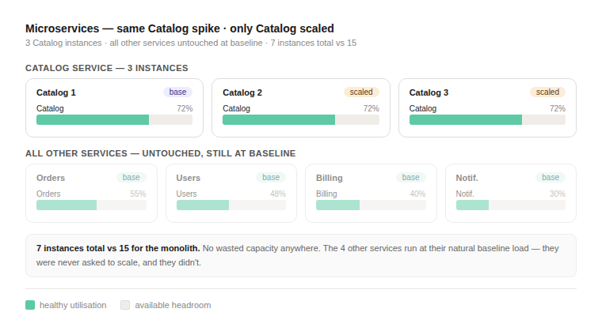

# Microservices Foundations

## What is a microservice?

A microservice is a small, independently deployable unit that owns a single business capability. Rather than one large application handling everything, each concern - users, catalog, orders, billing, notifications - lives in its own process, with its own codebase, database, and deployment lifecycle.

Services communicate over the network - typically REST/HTTP for synchronous calls, or a message bus (Kafka, JMS/ActiveMQ) for asynchronous events.

---

## The scaling problem

In a monolith, the unit of scale is the entire application. If one module gets a traffic spike, the only lever is to clone the whole thing.

### Healthy baseline - no scaling needed


At normal load both architectures look identical. Catalog runs at ~72%, everything else between 30–55%. This is the target zone: busy enough to justify the instance, with headroom to absorb a burst. No scaling needed.

### Monolith under a Catalog spike


Catalog's traffic tripled. To bring it back to a healthy utilisation level the monolith scales to 3 instances. The load balancer distributes evenly - Catalog lands at 72% on each instance. But Orders, Users, Billing, and Notif. had their traffic split across 3 instances too, dropping from 30–55% to 10–18%. 
You paid for 15 module-instances to solve a 3-instance Catalog problem.

### Microservices under the same spike



Only the Catalog service scaled. Its load balancer split traffic across 3 Catalog instances - each sitting at 72%, right in the healthy zone. Every other service stayed exactly at baseline on a single instance. 
Total: 7 instances vs 15. No wasted capacity.

---

## Benefits of Microservices

### Independent scalability

Each service scales on its own terms. If Catalog sees a traffic spike, only the Catalog service gets new instances - Orders, Billing, and Notifications stay exactly where they are. You pay for what you need, where you need it.

This also means you can apply different scaling strategies per service. A CPU-bound image processing service scales horizontally with more instances. A memory-bound caching service scales vertically with larger instances. A queue-backed notification service scales based on queue depth rather than CPU. In a monolith, all of these would share the same scaling policy because they share the same process.

### Resilience and failure isolation

In a monolith, a bug in the Notification module can take down the entire application - one unhandled exception, one memory leak, one thread pool exhaustion can crash Orders, Catalog, and Billing alongside it. This is the cascading failure problem.

Microservices contain failures at the service boundary. If the Notification service crashes, Orders keeps processing. If the Recommendation service develops a memory leak, Checkout is unaffected. The blast radius of any single failure is limited to the users and services that depend on that one capability.

This isolation is reinforced by patterns like the **circuit breaker**: when a downstream service becomes slow or unresponsive, the circuit opens and calls short-circuit to a fallback immediately, rather than letting threads pile up and starve the calling service of resources. The system degrades gracefully instead of failing completely.


For critical user-facing systems - e-commerce, banking, healthcare - the difference between "the recommendation engine is down" and "the entire site is down" is enormous, both operationally and commercially.

### Technology flexibility (polyglot architecture)

A monolith has one tech stack. Every module uses the same language, the same framework, the same database engine, because they all live in the same
deployable. Adding a new dependency means the whole application takes it on.


In a microservices architecture, each service owns its technology choices independently:

- A latency-sensitive routing service can be written in Go or Rust
- A data-science-heavy recommendation engine can be Python with PyTorch
- A legacy integration service can stay on Java 11 while the rest of the system moves to Java 21
- A read-heavy catalog service can use Elasticsearch while a transactional order service uses PostgreSQL
- A notification service can use a lightweight framework like Micronaut or Quarkus rather than the full Spring Boot stack

This is called a **polyglot architecture**. The constraint is the contract between services - the API shape and the message format - not the implementation behind it. Teams pick the right tool for their specific job rather than the least-wrong tool for the whole system.

In practice, most teams don't go fully polyglot - operational consistency has real value. But having the *option* to diverge when it genuinely matters is a significant architectural advantage.

### Independent deployability

In a monolith, deploying a one-line bug fix in Billing requires a full application build, test, and release. Every team's changes go out together, which means coordinating release windows, freezing code, and accepting risk from changes that have nothing to do with your fix.

In microservices, the Billing team deploys Billing. The Catalog team deploys Catalog. Releases are smaller, lower-risk, and more frequent. A team that owns a service end-to-end can ship a fix in hours rather than waiting for the next coordinated release cycle.

This maps directly to modern delivery practices: each service has its own CI/CD pipeline, its own test suite, its own deployment cadence. Canary deployments (routing 5% of traffic to the new version), blue/green deployments (keeping the old version live until the new one is verified), and rolling updates all become practical at the service level in ways that are difficult to achieve for a monolith.

### Team autonomy and ownership

Conway's Law states that a system's architecture tends to mirror the communication structure of the organisation that built it. Monoliths encourage - and often require - large, tightly coordinated teams. Every team touches the same codebase, which means merge conflicts, shared test environments, and shared release processes.

Microservices invert this. Each service maps to a small team that owns it end-to-end: design, build, test, deploy, and operate. That team makes technology decisions, sets its own standards, and ships independently. There is no shared codebase bottleneck.

The Amazon "two-pizza team" model is the canonical example: if a team can't be fed by two pizzas, it's too big, and the service it owns is probably too big too. Small teams with tight ownership move faster and take more accountability for the thing they built.

### Maintainability at scale

A 5-year-old monolith tends to become a "big ball of mud" - modules that were supposed to be independent develop implicit dependencies, shared database tables get used across concerns, and the cost of understanding and changing any part of the system grows over time.

Microservices enforce boundaries structurally. If the Catalog service and the Order service have separate databases, it is architecturally impossible for Order to directly query Catalog's schema - any data sharing has to go through the API. This forces good design discipline that a monolith can only enforce by convention.

Each service is also small enough to be fully understood by the team that owns it. Onboarding a new engineer to a 500-line service with a clear domain boundary is a different experience from onboarding them to a 500,000-line monolith.

### Granular observability

When something goes wrong in a monolith, the question is "which module caused it?" and the answer requires reading logs, tracing call stacks, and making inferences. You can observe the whole but not easily the parts.

In microservices, each service emits its own metrics, logs, and traces. You can see exactly which service is slow, which is throwing errors, and which upstream dependency is causing the problem - without guessing. Distributed tracing tools (Micrometer + Zipkin) let you follow a single user request across every service it touched, with timing data for each hop.

This granularity makes debugging faster and makes SLA accountability clearer: you know exactly which service missed its latency target.

---

## What you take on

These benefits come with real costs. Microservices are not the right choice for every system, and they're not free even when they are.

**Distributed system complexity** - network calls fail in ways that in-process calls don't. You need timeouts, retries, circuit breakers, and idempotency handling everywhere a service calls another service. A monolith with a bug is a bug. A microservices system with a misconfigured timeout is a cascading failure.

**No shared transactions** - ACID transactions across service boundaries don't exist. If updating Orders and sending a Notification need to happen atomically, you need the Saga pattern: a sequence of local transactions coordinated by events, with compensating transactions to roll back on failure. This is significantly more complex than a database transaction.

**Operational overhead** - you now have 10 services instead of 1. Each needs its own deployment pipeline, its own health monitoring, its own log aggregation, its own dependency management. The tooling that makes this manageable (Kubernetes, Docker, Prometheus, distributed tracing) is itself a significant investment to learn and operate.

**Testing complexity** - unit testing a service in isolation is easy. Testing the behaviour of 5 services interacting is hard. Contract testing (Spring Cloud Contract) and consumer-driven contracts help, but the test surface area is larger and harder to reason about than a monolith.

**Start with a monolith** - for a new product with unclear domain boundaries, a monolith is usually the right first choice. Extract services when boundaries become clear, when a specific module has scaling needs that differ from the rest, or when team ownership genuinely warrants separation. Premature decomposition into microservices creates all the operational overhead with none of the organizational benefit.

---

## Communication Between Services

Microservices need to talk to each other. For synchronous calls, where the
caller needs an immediate response, Spring Boot uses HTTP clients to make
REST calls directly from one service to another.

### RestClient

`RestClient` is the current Spring HTTP client, introduced in Spring 6.1 and
the recommended choice for new Spring Boot 3.x projects. It replaces the
deprecated `RestTemplate` with a fluent, readable API. Unlike `WebClient`
(which is reactive/non-blocking), `RestClient` is straightforward and
synchronous - the right default for most service-to-service calls.

**Dependency** — no extra dependency needed. `RestClient` is included in
`spring-boot-starter-web`.

**Creating a client**

The simplest approach is to inject a `RestClient.Builder` and build a
pre-configured client in your service class or `@Configuration`:

```java
@Service
public class CatalogClient {

    private final RestClient restClient;

    public CatalogClient(RestClient.Builder builder) {
        this.restClient = builder
            .baseUrl("http://localhost:8082")
            .build();
    }
}
```

If you have Eureka on the classpath, Spring will automatically configure the
builder with a load-balanced `baseUrl` resolver — so `http://catalog-service`
resolves via the service registry rather than a hardcoded host.

**GET — fetch a resource**
```java
public CatalogItem getItem(String itemId) {
    return restClient.get()
        .uri("/items/{id}", itemId)
        .retrieve()
        .body(CatalogItem.class);
}
```

**GET — fetch a list**
```java
public List<CatalogItem> getAllItems() {
    return restClient.get()
        .uri("/items")
        .retrieve()
        .body(new ParameterizedTypeReference<List<CatalogItem>>() {});
}
```

**POST — send a body**
```java
public Order createOrder(OrderRequest request) {
    return restClient.post()
        .uri("/orders")
        .contentType(MediaType.APPLICATION_JSON)
        .body(request)
        .retrieve()
        .body(Order.class);
}
```

**Using `exchange` — access the full response**

When you need the response status code or headers alongside the body, use
`exchange` instead of `retrieve`:
```java
public CatalogItem getItemWithMeta(String itemId) {
    return restClient.get()
        .uri("/items/{id}", itemId)
        .exchange((request, response) -> {
            if (response.getStatusCode().is2xxSuccessful()) {
                return response.bodyTo(CatalogItem.class);
            } else if (response.getStatusCode() == HttpStatus.NOT_FOUND) {
                throw new ItemNotFoundException("Item not found: " + itemId);
            } else {
                throw new RuntimeException(
                    "Unexpected status: " + response.getStatusCode()
                );
            }
        });
}
```

`exchange` gives you full control — useful when your branching logic depends
on status codes, when you need to read a response header (e.g. `Location`
after a `201 Created`), or when different status codes should produce
different return types.
```java
public URI createOrderAndGetLocation(OrderRequest request) {
    return restClient.post()
        .uri("/orders")
        .contentType(MediaType.APPLICATION_JSON)
        .body(request)
        .exchange((request, response) -> {
            if (response.getStatusCode() == HttpStatus.CREATED) {
                return response.getHeaders().getLocation();
            }
            throw new RuntimeException(
                "Order creation failed: " + response.getStatusCode()
            );
        });
}
```

Note that when using `exchange`, Spring does not automatically close the
response body — you are responsible for consuming or closing it inside the
lambda to avoid resource leaks.

**Handling errors**

By default, `RestClient` throws `HttpClientErrorException` (4xx) or
`HttpServerErrorException` (5xx) on error responses. You can handle these
with a `onStatus` block:
```java
public CatalogItem getItem(String itemId) {
    return restClient.get()
        .uri("/items/{id}", itemId)
        .retrieve()
        .onStatus(HttpStatusCode::is4xxClientError, (request, response) -> {
            throw new ItemNotFoundException("Item not found: " + itemId);
        })
        .body(CatalogItem.class);
}
```

---

## Core patterns in microservices architecture


### 1. Service discovery

Services don't communicate via hardcoded IP addresses - instances spin up and down dynamically. A service registry solves this.

- Each service registers itself on startup with its host, port, and health metadata
- Callers query the registry to resolve an address before making a request
- Heartbeats detect and evict crashed instances automatically

**What to use: Netflix Eureka** (`@EnableEurekaServer`, `@EnableDiscoveryClient`). Eureka is in maintenance mode upstream at Netflix - no new features are being added - but it remains fully supported in Spring Cloud and is the simplest hands-on option. You will also encounter **HashiCorp Consul** in enterprise environments; it offers more advanced features (multi-datacenter support, DNS interface, built-in key-value config store) but adds operational complexity that isn't necessary at this level. Understand both exist, but we'll be implementing Eureka.

#### How Eureka works in detail

**Registration**

When a Eureka client starts up it sends a `POST` to the Eureka server's REST API with its instance metadata: application name, hostname, IP, port, and health check URL. The server records this in its registry. The client retries on failure, so a brief server unavailability at startup doesn't prevent registration.

**Heartbeat (renewal)**

After registering, the client sends a heartbeat `PUT` to the server every **30 seconds** by default. This tells the server "I'm still alive." The interval is controlled by:

```yaml
eureka:
  instance:
    lease-renewal-interval-in-seconds: 30  # how often client sends heartbeat
```

If the server receives no heartbeat for **90 seconds** (3 missed intervals), it marks the instance as expired and evicts it from the registry. This threshold is:

```yaml
eureka:
  instance:
    lease-expiration-duration-in-seconds: 90  # server waits this long before evicting
```

**Fetching the registry**

Clients don't query the server on every service call - that would be too slow. Instead, each client maintains a **local cache** of the full registry and refreshes it every **30 seconds**:

```yaml
eureka:
  client:
    registry-fetch-interval-seconds: 30  # how often client pulls registry updates
```

The first fetch is a full pull. Subsequent fetches are delta updates - only changes since the last fetch are sent, keeping the payload small. When a service call is made, the client resolves the address from its local cache instantly, with no network round-trip to the registry.

This means there is an inherent eventual consistency window: a new instance can take up to ~30 seconds to appear in other services' caches, and a crashed instance can take up to ~90 seconds to disappear.

**Self-preservation mode**

Eureka has a built-in protection against false evictions caused by network partitions. If the server detects that it is receiving fewer than 85% of the expected heartbeats across all instances, it stops evicting instances even if individual heartbeat timeouts are breached. The assumption is: if many instances stop sending heartbeats at once, the problem is probably the network between the client and the server, not the clients themselves. This prevents the registry from being wiped clean during a transient network event.

In development you may want to disable this since you often have very few instances and any missed heartbeat triggers self-preservation:

```yaml
eureka:
  server:
    enable-self-preservation: false  # useful in dev, leave enabled in production
```

**Full lifecycle summary**

```
Client starts
    └─→ POST /eureka/apps/{appName}      (registration)

Every 30s
    └─→ PUT /eureka/apps/{appName}/{id}  (heartbeat / renewal)

Every 30s
    └─→ GET /eureka/apps (delta)         (fetch registry updates into local cache)

Client shuts down gracefully
    └─→ DELETE /eureka/apps/{appName}/{id} (de-registration)

Server receives no heartbeat for 90s
    └─→ instance evicted from registry
```

### 2. API gateway

Clients shouldn't know which service lives where. The gateway is the single entry point for all external traffic. Without a gateway, every external client (mobile app, frontend, third-party) must know the addresses of all services, handle auth independently, and manage versioning per-service. The gateway centralizes all of that at the edge.

**What to use: Spring Cloud Gateway.** This is the current, actively maintained Spring default - built on Project Reactor and Spring WebFlux (non-blocking). It replaced Netflix Zuul, which has been removed from Spring Cloud entirely and is incompatible with Spring Boot 3. Do not use Zuul for new projects. If you see it in legacy codebases, treat it as a migration candidate.

#### Benefits of the gateway pattern

**Single entry point** — external clients talk to one host and one port. The internal topology (which services exist, how many instances, which ports) is an implementation detail that clients never see. You can refactor, split, or rename services internally without changing the client's API.

**Security boundary** — authentication and authorization happen once at the gateway before any request reaches a downstream service. Internal services can trust that if a request arrived, it has already been validated. This avoids duplicating auth logic across every service.

**Cross-cutting concerns in one place** — rate limiting, request logging, CORS headers, SSL termination, and response compression are implemented once at the gateway rather than in every service individually.

**Protocol translation** — external clients speak HTTP/REST; internal services might speak gRPC, WebSocket, or expose different path conventions. The gateway can translate between them.

**API composition** — some gateways (including Spring Cloud Gateway with custom filters) can aggregate responses from multiple services into a single response, reducing the number of round trips a client must make.

**Traffic management** — canary deployments and A/B testing become a gateway-level concern. You can route 5% of traffic to a new version of a service without the client knowing.

#### How Spring Cloud Gateway works

Spring Cloud Gateway is built on **Project Reactor** and **Spring WebFlux**, which means it is fully non-blocking and reactive. Every request is handled on a small thread pool using an event loop rather than the traditional one-thread-per-request model. This makes it efficient under high concurrency - the gateway can proxy thousands of simultaneous connections without proportionally scaling threads.

Because of this, Gateway uses **WebFlux**, not the standard servlet stack. This is why you must not include `spring-boot-starter-web` in the gateway's `pom.xml` - the two stacks conflict at the dependency level.

**The three parts of a route**

Every route has three components:

```
Route = ID + Predicate(s) + URI  [+ optional Filters]
```

- **ID** — a unique name used in logs and actuator output
- **Predicate** — the condition that must be true for this route to match the incoming request
- **URI** — where to forward the request if the predicate matches
- **Filters** — optional transformations applied before forwarding (pre-filters) or after receiving the response (post-filters)

**Predicates**

Predicates are evaluated against the incoming `ServerWebExchange`. The most common is `Path`, but there are many built-in options:

```yaml
predicates:
  - Path=/orders/**            # URL path pattern
  - Method=GET,POST            # HTTP method
  - Header=X-Request-Id, \d+  # header name + regex value
  - Query=region, WEST         # query param name + value
  - Cookie=session, abc123     # cookie name + value
  - After=2025-01-01T00:00:00Z # only match after a date (canary scheduling)
```

Multiple predicates on the same route are AND'd together - all must match.

**Filters**

Filters are applied in a chain, similar to servlet filters. 

```yaml
routes:
  - id: order-service
    uri: lb://order-service
    predicates:
      - Path=/orders/**
    filters:
      - AddRequestHeader=X-Source, gateway       # add header before forwarding
      - AddResponseHeader=X-Served-By, gateway   # add header to response
      - StripPrefix=1                            # strip /api from /api/orders/5
```

Spring Cloud Gateway also supports **global filters** that apply to every route without needing to declare them per-route - useful for logging, auth token validation, and correlation ID propagation.

**The `lb://` protocol and Eureka integration**

When the URI starts with `lb://`, Spring Cloud Gateway hands resolution off to **Spring Cloud LoadBalancer**:

1. Gateway receives a request matching the route
2. It looks up `order-service` in the load balancer's service instance list
3. The load balancer queries its local Eureka registry cache for all healthy instances of `order-service`
4. It picks one (round-robin by default) and returns the actual host and port
5. Gateway forwards the request to that resolved address

This means the gateway itself benefits from the same Eureka heartbeat and registry-fetch mechanism described above - it maintains a local cache of instances and resolves them without a registry round-trip on every request.

**Request flow**

```
External client
    └─→ GET :8080/orders/5
         │
         ▼
    Gateway (port 8080)
    ├─ Predicate check: Path=/orders/** ✓
    ├─ Pre-filters run (auth, logging, rate limit)
    ├─ lb://order-service → resolve via Eureka → :8084
    ├─ Forward: GET :8084/orders/5
    ├─ Receive response from order-service
    └─ Post-filters run (add headers, transform body)
         │
         ▼
External client receives response
```

**Configuration in `application.yml`**

```yaml
spring:
  cloud:
    gateway:
      routes:
        - id: order-service
          uri: lb://order-service       # lb:// triggers load-balanced resolution
          predicates:
            - Path=/orders/**           # matches /orders, /orders/5, /orders/status/RECEIVED
        - id: warehouse-service
          uri: lb://warehouse-service
          predicates:
            - Path=/warehouses/**
```

Routes are evaluated in order - the first matching route wins. If no route matches, the gateway returns a 404.

### 3. Load balancing

With multiple instances of a service running, incoming requests must be distributed across them. There are two broad approaches:

- **Client-side** (Spring Cloud LoadBalancer): the calling service itself resolves available instances from the registry and picks one. No extra network hop, no proxy in the critical path.
- **Server-side** (NGINX, AWS ALB, Kubernetes Service): a dedicated proxy sits in front of the service instances and routes traffic. Simpler for clients, but adds a network hop and a component to manage.

**What to use: Spring Cloud LoadBalancer.** This is the current default, replacing Netflix Ribbon which has been removed from Spring Cloud. If you encounter `ribbon` in configuration files or `@RibbonClient` annotations, they are from legacy projects and should be migrated.

#### How Spring Cloud LoadBalancer works

**Instance list and local cache**

Spring Cloud LoadBalancer does not query Eureka on every request - that would add a network round-trip to every service call. Instead it maintains a local cache of instances for each service, populated from Eureka's registry. This cache is refreshed on the same 30-second interval as the Eureka client's registry fetch. When a load-balancing decision is needed, the cache is consulted in memory.

**Selecting an instance**

The default algorithm is **round-robin**: requests cycle through the available instances in order.

```
Instance list: [order-service:8084, order-service:8085, order-service:8086]

Request 1 → :8084
Request 2 → :8085
Request 3 → :8086
Request 4 → :8084  (wraps around)
```

Spring Cloud LoadBalancer also ships a **random** algorithm. You can switch it or provide your own `ReactorServiceInstanceLoadBalancer` bean to implement custom logic (e.g. weighted routing, zone-awareness, sticky sessions).


**The `@LoadBalanced` annotation**

When you annotate a `RestClient.Builder` or `WebClient.Builder` bean with `@LoadBalanced`, Spring wraps it with a load-balancing interceptor. This interceptor intercepts calls to logical service names (e.g. `http://order-service/orders`) and replaces them with real resolved addresses before the request goes out.

```java
@Bean
@LoadBalanced
public RestClient.Builder restClientBuilder() {
    return RestClient.builder().baseUrl("http://warehouse-service");
}
```

Without `@LoadBalanced`, the URL `http://warehouse-service` would fail DNS resolution because `warehouse-service` is not a real hostname. With it, the interceptor replaces it with a real `host:port` pulled from the load balancer cache.

In practice, most Spring Cloud microservices use client-side load balancing internally between services (via `@LoadBalanced` + Eureka) and server-side load balancing at the edge (the gateway or an external load balancer in front of the gateway).

### 4. Resilience strategies

When a downstream service is slow or failing, the default behavior in a microservice is bad: threads pile up waiting for responses, timeouts cascade, and the calling service eventually runs out of resources. Resilience4j provides a set of composable strategies to prevent this.

**What to use: Resilience4j** (`@CircuitBreaker`, `@Retry`, `@Bulkhead`, `@RateLimiter`). Resilience4j is the current default in Spring Cloud Circuit Breaker and is actively maintained. It replaced Netflix Hystrix, which is deprecated and has been removed from Spring Cloud. Do not use Hystrix for new projects.

**Dependency:**
```xml
<dependency>
    <groupId>org.springframework.cloud</groupId>
    <artifactId>spring-cloud-starter-circuitbreaker-resilience4j</artifactId>
</dependency>
```

#### Retry

Retry handles **transient failures** — brief network blips or a service instance that was briefly restarting. Instead of immediately surfacing the error to the caller, the same request is attempted again after a short wait.

```java
@Retry(name = "warehouseService")
public Optional<WarehouseSummary> findWarehouseForOrder(Order order) { ... }
```

```yaml
resilience4j:
  retry:
    instances:
      warehouseService:
        max-attempts: 3       # 1 original attempt + 2 retries
        wait-duration: 500ms  # pause between each attempt
```

Retry is appropriate when:
- The failure is likely temporary (network hiccup, brief pod restart)
- The operation is **idempotent** — calling it multiple times has the same effect as calling it once. A `GET` is always safe to retry. A `POST` that creates a resource is not, unless the downstream service handles duplicates.

Retry is **not** appropriate for sustained outages — blindly retrying a service that has been down for minutes just adds load and delays the fallback.

#### Circuit breaker

The circuit breaker prevents retry storms and thread exhaustion during sustained outages. It monitors the outcome of calls and, after enough failures, **opens** the circuit — subsequent calls short-circuit immediately to a fallback without attempting the real call at all.

**States:**

```
          too many failures
[Closed] ─────────────────→ [Open]
                               │
                    wait-duration-in-open-state
                               │
                               ↓
                           [Half-Open]  ← probe calls allowed through
                           /        \
                    success          failure
                       │                │
                       ↓                ↓
                   [Closed]          [Open]
```

- **Closed** — normal operation; failures are counted in a sliding window
- **Open** — failure threshold exceeded; all calls short-circuit to the fallback immediately
- **Half-open** — after the open wait period, a small number of probe calls are allowed through to test if the service has recovered

```java
@CircuitBreaker(name = "warehouseService", fallbackMethod = "warehouseFallback")
@Retry(name = "warehouseService")
public Optional<WarehouseSummary> findWarehouseForOrder(Order order) { ... }

// Invoked by Resilience4j via reflection when all retries fail or circuit is open.
// Signature must match the original method plus a Throwable as the last parameter.
@SuppressWarnings("unused")
private Optional<WarehouseSummary> warehouseFallback(Order order, Throwable t) {
    System.out.println("Warehouse service unavailable: " + t.getMessage());
    return Optional.empty();  // order-service will cancel the order gracefully
}
```

```yaml
resilience4j:
  circuitbreaker:
    instances:
      warehouseService:
        sliding-window-size: 5               # evaluate the last 5 call outcomes
        failure-rate-threshold: 60           # open if ≥60% of those calls failed
        wait-duration-in-open-state: 10s     # stay open for 10s before probing
        permitted-number-of-calls-in-half-open-state: 2  # probe with 2 calls
```

#### How retry and circuit breaker compose

When both annotations are on the same method, they wrap each other:

```
Request
  └─→ CircuitBreaker  (is circuit open? if yes → fallback immediately)
        └─→ Retry  (attempt up to max-attempts times)
              └─→ actual service call
```

`@CircuitBreaker` must be the **outer** decorator and `@Retry` the **inner** one. This means:
- Retry fires first and handles transient failures invisibly
- Only after all retries are exhausted does the circuit breaker record a failure
- 3 retries all failing = **1 failure** counted by the circuit breaker, not 3

If you reversed the order, the circuit breaker would count each individual retry attempt as a failure, and the circuit would open far too aggressively.

#### The fallback

The fallback method is the graceful degradation path — what the service does when the downstream is genuinely unavailable. It must:
- Have the **same return type** as the original method
- Accept the **same parameters** as the original method
- Have a **`Throwable`** as the final parameter (Resilience4j passes the cause)

In this codebase, `warehouseFallback` returns `Optional.empty()`, which causes `OrderService` to set the order status to `CANCELLED` rather than throwing. The system degrades gracefully — orders are acknowledged and recorded, just not fulfilled until the warehouse service recovers.

### 5. Asynchronous messaging

Not every service call needs an immediate response. Decoupling producers and consumers via a message broker allows services to operate independently of each other's availability.

| Pattern | Description | Use case |
|---|---|---|
| Queue | One producer → one consumer | Order placed → fulfillment picks it up |
| Topic/pub-sub | One producer → many consumers | `OrderShipped` → Notification + Analytics |

**What to use: ActiveMQ Artemis for hands-on JMS work; understand Kafka as the at-scale alternative.**

Artemis is the current, actively maintained next-generation ActiveMQ broker. It supports the JMS standard (`@JmsListener`), and can run as an embedded broker in Spring Boot, and maps directly to enterprise integration patterns. 

Apache Kafka is the dominant event streaming platform in modern microservices at scale. It is designed for extremely high throughput, persistent message retention, and replay - Kafka keeps messages on disk and consumers can re-read them, unlike Artemis which deletes messages once consumed. In practice, Artemis and Kafka are not direct competitors: an enterprise system might use Artemis for internal service-to-service transactional messaging and Kafka for high-volume event streams feeding analytics pipelines. Kafka is worth understanding conceptually; Artemis is the right tool to implement in this curriculum given the JMS foundation already established.

In Spring Boot: `@JmsListener` with ActiveMQ Artemis for queues; `@KafkaListener` with Apache Kafka for event streaming.

### 6. Config server

Hardcoding configuration per service leads to inconsistency and makes environment-specific values (DB URLs, credentials, feature flags) difficult to manage across dozens of services.

A config server externalizes all configuration into a central store - typically a Git repository - and serves it to services on startup and on refresh.

**What to use: Spring Cloud Config Server.** Actively maintained, no deprecation concerns. Services pull config via `spring.config.import=configserver:http://config:8888`. Config can be refreshed at runtime via `/actuator/refresh` without redeployment using `@RefreshScope`.

Note: Consul can also serve as a config store if you are already using it for service discovery, making the Spring Cloud Config Server redundant in that setup. Since the curriculum uses Eureka (not Consul), Spring Cloud Config is the natural pairing.

### 7. Containerization

Each service and its runtime dependencies are packaged into a Docker image. This ensures the service behaves identically in development, CI, and production.

Key concepts:
- **Dockerfile** - recipe for building the image (base image, copy jar, entrypoint)
- **Image** - immutable snapshot of the service and its runtime
- **Container** - a running instance of an image; isolated process
- **Docker Compose** - defines all services, networks, and volumes for local development in a single `docker-compose.yml`

In production, container orchestration (Kubernetes) manages scheduling, health checks, scaling, and rolling deployments across a cluster.

### 8. Monitoring and distributed tracing

In a monolith, a stack trace tells you exactly what happened. In microservices, a single user request may touch 5–10 services - a failure anywhere in the chain is hard to trace without tooling.

**Metrics** (what happened):
- Expose via Spring Boot Actuator → Prometheus scrapes → Grafana visualizes
- Key signals: request rate, error rate, latency (p95/p99), CPU/memory

**Distributed tracing** (where it happened):
- Each request is assigned a trace ID that propagates across service boundaries via HTTP headers
- **Micrometer Tracing** + **Zipkin** or **Jaeger**: visualize the full call tree - which service called which, how long each hop took, where latency or errors originated

**Centralized logging**:
- Services write structured logs (JSON) to stdout
- A log aggregator (ELK stack: Elasticsearch, Logstash, Kibana) or **Grafana Loki** collects, indexes, and makes them searchable
- Correlate logs across services using the trace ID

The goal is **observability**: the ability to ask arbitrary questions about system behavior from the outside, without needing to add new instrumentation after the fact.

---

## Spring Boot tooling map

| Pattern | Supporting Technology | Deprecated Technology |
|---|---|---|
| Service discovery | Spring Cloud Netflix Eureka | - |
| API gateway | Spring Cloud Gateway | ~~Netflix Zuul~~ (removed) |
| Load balancing | Spring Cloud LoadBalancer | ~~Netflix Ribbon~~ (removed) |
| Circuit breaking | Resilience4j | ~~Netflix Hystrix~~ (removed) |
| Messaging (transactional) | Spring JMS + ActiveMQ Artemis | - |
| Messaging (streaming) | Apache Kafka | - |
| Config management | Spring Cloud Config Server | - |
| Containerization | Docker + Docker Compose | - |
| Metrics | Spring Actuator + Prometheus + Grafana | - |
| Distributed tracing | Micrometer + Zipkin | - |
| Centralized logging | ELK stack / Grafana Loki | - |
