# Core Patterns: Service Discovery

This section covers the first core infrastructure pattern in a Spring Cloud microservices architecture. The diagram below shows all the patterns together — service discovery is the foundation that everything else builds on.



### 1. Service discovery

Services don't communicate via hardcoded IP addresses - instances spin up and down dynamically. A service registry solves this.

- Each service registers itself on startup with its host, port, and health metadata
- Callers query the registry to resolve an address before making a request
- Heartbeats detect and evict crashed instances automatically

**What to use: Netflix Eureka** (`@EnableEurekaServer`, `@EnableDiscoveryClient`). Eureka is in maintenance mode upstream at Netflix - no new features are being added - but it remains fully supported in Spring Cloud and is the simplest hands-on option. You will also encounter **HashiCorp Consul** in enterprise environments; it offers more advanced features (multi-datacenter support, DNS interface, built-in key-value config store) but adds operational complexity that isn't necessary at this level. Understand both exist, but we'll be implementing Eureka.

#### How Eureka works in detail

**Registration**

When a Eureka client starts up it sends a `POST` to the Eureka server's REST API with its instance metadata: application name, hostname, IP, port, and health check URL. The server records this in its registry. The client retries on failure, so a brief server unavailability at startup doesn't prevent registration.

**Heartbeat (renewal)**

After registering, the client sends a heartbeat `PUT` to the server every **30 seconds** by default. This tells the server "I'm still alive." The interval is controlled by:

```yaml
eureka:
  instance:
    lease-renewal-interval-in-seconds: 30  # how often client sends heartbeat
```

If the server receives no heartbeat for **90 seconds** (3 missed intervals), it marks the instance as expired and evicts it from the registry. This threshold is:

```yaml
eureka:
  instance:
    lease-expiration-duration-in-seconds: 90  # server waits this long before evicting
```

**Fetching the registry**

Clients don't query the server on every service call - that would be too slow. Instead, each client maintains a **local cache** of the full registry and refreshes it every **30 seconds**:

```yaml
eureka:
  client:
    registry-fetch-interval-seconds: 30  # how often client pulls registry updates
```

The first fetch is a full pull. Subsequent fetches are delta updates - only changes since the last fetch are sent, keeping the payload small. When a service call is made, the client resolves the address from its local cache instantly, with no network round-trip to the registry.

This means there is an inherent eventual consistency window: a new instance can take up to ~30 seconds to appear in other services' caches, and a crashed instance can take up to ~90 seconds to disappear.

**Self-preservation mode**

Eureka has a built-in protection against false evictions caused by network partitions. If the server detects that it is receiving fewer than 85% of the expected heartbeats across all instances, it stops evicting instances even if individual heartbeat timeouts are breached. The assumption is: if many instances stop sending heartbeats at once, the problem is probably the network between the client and the server, not the clients themselves. This prevents the registry from being wiped clean during a transient network event.

In development you may want to disable this since you often have very few instances and any missed heartbeat triggers self-preservation:

```yaml
eureka:
  server:
    enable-self-preservation: false  # useful in dev, leave enabled in production
```

**Full lifecycle summary**

```
Client starts
    └─→ POST /eureka/apps/{appName}      (registration)

Every 30s
    └─→ PUT /eureka/apps/{appName}/{id}  (heartbeat / renewal)

Every 30s
    └─→ GET /eureka/apps (delta)         (fetch registry updates into local cache)

Client shuts down gracefully
    └─→ DELETE /eureka/apps/{appName}/{id} (de-registration)

Server receives no heartbeat for 90s
    └─→ instance evicted from registry
```
