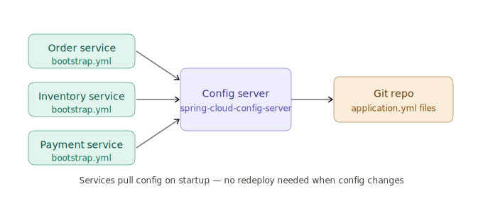
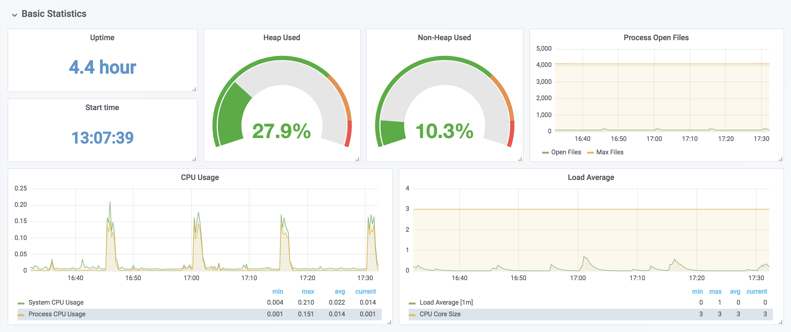
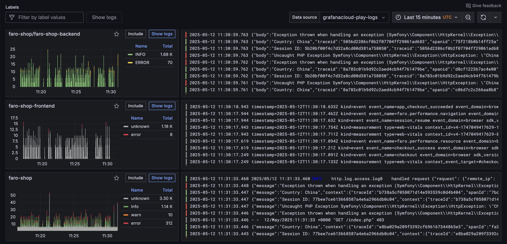
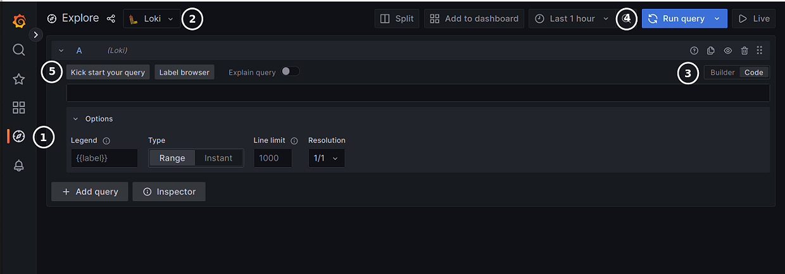

# Core Patterns: Messaging, Config & Operations

This section covers the remaining infrastructure patterns in a Spring Cloud microservices architecture - asynchronous communication between services, centralized configuration, containerization, and observability.

### 5. Asynchronous messaging

#### When to use HTTP, a queue, or Kafka

This is the core design decision, and the right answer comes down to one question: **does the caller need the result in order to continue?**

**Use HTTP (synchronous REST) when:**
- The caller needs the answer before it can do anything else
- The interaction is a query, not a notification
- Failure on the downstream side should surface immediately as an error to the caller

The Order → Warehouse call in this system is a good example. When a customer places an order, the Order service calls the Warehouse service to check stock *before* confirming the order. That result determines what happens next - you can't confirm the order and *later* find out there's no stock. The call is a question with an answer that gates the next step. HTTP is the right choice.

```
POST /orders
  → GET /warehouse/stock/{productId}   ← must know the answer NOW
  ← { available: true }
  → save order, return 201 to customer
```

**Use a message queue (Artemis/JMS) when:**
- The work is a side effect that doesn't need to complete before the response
- You want guaranteed delivery but don't need the work to happen at high volume
- The interaction is "do this exactly once" - one consumer handles each message

After the order is confirmed, you need Fulfillment to start picking, and Notification to send a confirmation email. Neither of those needs to happen before the customer gets their order confirmation. If either service is temporarily down, the message waits in the queue and gets processed when it comes back up - the order isn't lost.

```
POST /orders
  → GET /warehouse/stock/{productId}   ← HTTP, need the answer
  ← { available: true }
  → save order
  → queue.send("order.placed", event)  ← fire and forget
  ← 201 to customer (Fulfillment and Notification happen asynchronously)
```

**Use Kafka when:**
- Volume is high and throughput matters (thousands+ events/second)
- Multiple independent consumers need to react to the same event
- You need replay: consumers that come online later can reprocess past events
- You're building an event log - the history of what happened is itself valuable

Kafka is less about "deliver this task to a worker" and more about "record that this thing happened, and let anyone who cares react." An `OrderShipped` event might be consumed by Notification, Analytics, a Returns eligibility service, and a loyalty points service - all independently, at their own pace. If you add a new consumer six months from now, Kafka can replay every `OrderShipped` event from the beginning.

**The decision at a glance:**




---

#### The problem

Synchronous REST calls mean your services are temporally coupled: if the downstream service is slow, your upstream service is slow. If the downstream service is down, your upstream service fails. In a checkout flow where messaging is *not* used, that might look like this:

```
POST /orders
  → calls Inventory to reserve stock (300ms)
  → calls Payment (500ms)
  → calls Notification (200ms, but it's down)
  → entire request fails after 1 second
```

Notification doesn't need to send the email *before* the user gets their confirmation page - that's a design smell. Asynchronous messaging flips this: the Order service publishes an event to a broker and immediately returns. Downstream services consume that event whenever they're ready. If Notification is down, it processes the message when it comes back up - the order isn't lost, and the checkout didn't fail.

#### The two core messaging patterns

| Pattern | Shape | Use case |
|---|---|---|
| **Queue** (point-to-point) | One producer → one consumer | `order.placed` → Fulfillment picks up and processes it exactly once |
| **Topic / pub-sub** | One producer → many consumers | `order.shipped` → Notification sends email *and* Analytics records the event |

The key difference: with a queue, one consumer "wins" the message. With a topic, every subscriber gets a copy.

#### What's out there

**ActiveMQ Artemis** - implements JMS (Java Message Service), the standard Java API for messaging. Supports both queues and topics. Can run embedded in Spring Boot for development, or as a standalone broker. Maps well to classic enterprise integration patterns.

**Apache Kafka** - not a message queue in the traditional sense; it's a distributed *event log*. Messages (called records) are written to partitioned, ordered logs on disk and *retained* for a configurable period. Consumers read from any offset - they can replay history, which is impossible with traditional queues. Designed for massive throughput (millions of events/second across a cluster). The dominant choice for high-volume event streaming, data pipelines, and event sourcing.

**RabbitMQ** - implements AMQP. More routing flexibility than JMS; common in polyglot environments (not Java-specific). A reasonable middle ground between Artemis and Kafka.

In practice these aren't strict competitors. A real system might use Artemis for internal transactional messaging between services and Kafka for an analytics event stream feeding a data warehouse.

#### What it looks like in Spring Boot

**Publishing a message (Artemis/JMS):**
```java
// Order service sends an event after saving the order
@Service
public class OrderService {
    private final JmsTemplate jmsTemplate;

    public Order placeOrder(OrderRequest request) {
        Order order = orderRepository.save(new Order(request));
        jmsTemplate.convertAndSend("order.placed", new OrderPlacedEvent(order.getId()));
        return order;  // returns immediately - doesn't wait for fulfillment
    }
}
```

**Consuming the message (in a separate service):**
```java
// Fulfillment service listens on the same queue
@Component
public class FulfillmentListener {

    @JmsListener(destination = "order.placed")
    public void onOrderPlaced(OrderPlacedEvent event) {
        // runs asynchronously, whenever this service is ready
        fulfillmentService.beginPicking(event.getOrderId());
    }
}
```

**Kafka equivalent** - same idea, different annotation:
```java
@KafkaListener(topics = "order-events", groupId = "fulfillment-service")
public void onOrderEvent(OrderEvent event) {
    fulfillmentService.beginPicking(event.getOrderId());
}
```

The `groupId` matters in Kafka: multiple instances of Fulfillment Service sharing the same group ID each get a partition's worth of messages - built-in load balancing across instances.

### 6. Config server

#### The problem

Every microservice has configuration: database URLs, credentials, timeouts, feature flags, third-party API keys. In a monolith, that all lives in one `application.yml`. In a microservices system with 10–20 services and 3+ environments (dev, staging, prod), you're looking at 30–60 config files - all of which need to stay in sync, all of which might contain secrets, and none of which you can change without redeploying the service.

The specific pain points:
- A database password rotates → you have to rebuild and redeploy every service that uses it
- You want to enable a feature flag in staging but not prod → you need environment-specific overrides scattered across repos
- Someone hardcodes a prod DB URL in a dev config → environment contamination, silent data corruption

#### What a config server does

A config server externalizes all configuration into a central, versioned store (typically a Git repository) and acts as an HTTP API that services query at startup. The structure is simple:

```
config-repo/
  application.yml          ← shared defaults for all services
  order-service.yml        ← overrides specific to order-service
  order-service-prod.yml   ← prod-only overrides for order-service
  inventory-service.yml
```

When `order-service` starts in the `prod` profile, the config server merges these in order: `application.yml` → `order-service.yml` → `order-service-prod.yml`. The service gets back one resolved config map.



#### What's out there

**Spring Cloud Config Server** - the standard choice for Spring ecosystems. Backed by a Git repo (or filesystem, Vault, S3). Services consume it with a single line in `application.yml`. Actively maintained; no deprecation concerns.

**HashiCorp Vault** - purpose-built for secrets management, not general config. Handles secret rotation, access policies, dynamic credentials (e.g., generates a short-lived DB password per service rather than sharing a static one). Often used alongside Config Server: Config Server handles non-secret config, Vault handles secrets.

**Consul** - if you're already using Consul for service discovery, it has a built-in key/value store that can serve config. Makes Spring Cloud Config Server redundant in that setup. This curriculum uses Eureka for service discovery, so Spring Cloud Config is the natural pairing.


#### What it looks like

**Config server setup** - just a Spring Boot app with one annotation and a pointer to the config repo:
```yaml
# config-server/src/main/resources/application.yml
server:
  port: 8888
spring:
  cloud:
    config:
      server:
        git:
          uri: https://github.com/your-org/config-repo
          default-label: main
```

**Service consuming config** - one line in the service's bootstrap config:
```yaml
# order-service/src/main/resources/application.yml
spring:
  config:
    import: "configserver:http://config-server:8888"
  application:
    name: order-service
  profiles:
    active: prod
```

That's it. The service fetches its resolved config from the server on startup. No file bundled in the JAR for environment-specific values.

**Runtime refresh without redeployment** - mark beans that hold config values with `@RefreshScope`, then hit the actuator endpoint:
```java
// Without @RefreshScope, maxPageSize is read once at startup and never changes.
// With @RefreshScope, hitting /actuator/refresh rebuilds this bean with the latest config value.
@RefreshScope
@Service
public class ProductSearchService {

    @Value("${search.max-page-size:50}")
    private int maxPageSize;

    public List<Product> search(SearchRequest request) {
        int size = Math.min(request.getPageSize(), maxPageSize);
        return productRepository.search(request.getQuery(), size);
    }
}
```

```bash
# Push a change to config-repo, then trigger refresh - no redeploy needed
curl -X POST http://order-service:8080/actuator/refresh
```

This endpoint is provided by `spring-cloud-starter-config` + `spring-boot-starter-actuator` and must be explicitly exposed via `management.endpoints.web.exposure.include: refresh` in your YAML.

The value updates in-place. In production this is typically triggered automatically via a Git webhook → Spring Cloud Bus (broadcasts the refresh to all service instances simultaneously).

### 7. Containerization

#### The problem

"It works on my machine" is the classic symptom. More broadly: services have runtime dependencies - a specific JDK version, a native library, an environment variable that has to be set just right. Without containerization, getting all of that consistent across a developer's laptop, the CI server, and production is a coordination problem that grows with every new service.

The deeper issue in microservices: you might have 15 services, each needing its own database, its own config, and specific startup order. Asking a new developer to install and configure all of that manually is a multi-hour onboarding tax and a source of subtle environment drift.

#### The core concepts

**Image** - an immutable, layered snapshot of your application and everything it needs to run (JDK, JAR, OS libraries). Built once, runs anywhere Docker is installed. Think of it as a recipe: the same recipe produces the same result whether you're cooking at home, in a test kitchen, or in a restaurant.

**Container** - a running instance of an image. Isolated from the host OS and from other containers (separate filesystem, network, process space). You can run ten containers from the same image simultaneously. If your image is your recipe, a container is your completed dish.

**Dockerfile** - the recipe for building an image:
```dockerfile
# Start from a base image that already has the JDK
FROM eclipse-temurin:21-jre-alpine

WORKDIR /app

# Copy the built JAR into the image
COPY target/order-service.jar app.jar

# What to run when the container starts
ENTRYPOINT ["java", "-jar", "app.jar"]
```

Build and run:
```bash
docker build -t order-service:latest .
docker run -p 8081:8081 order-service:latest
```

#### Docker Compose - the local development payoff

This is where containerization really pays off for a microservices dev environment. Instead of manually starting a broker, a database, a config server, and five services, you describe the whole system in one file:

```yaml
# docker-compose.yml
services:
  config-server:
    image: config-server:latest
    ports: ["8888:8888"]

  order-service:
    image: order-service:latest
    ports: ["8081:8081"]
    environment:
      SPRING_CONFIG_IMPORT: configserver:http://config-server:8888
    depends_on: [config-server, postgres, artemis]

  postgres:
    image: postgres:16
    environment:
      POSTGRES_DB: orders
      POSTGRES_PASSWORD: secret

  artemis:
    image: apache/activemq-artemis:latest
    ports: ["61616:61616"]
```

```bash
docker compose up   # entire system, one command
docker compose down # tear it all down
```

Every developer on the team runs the same environment. CI runs the same environment. No "I have Postgres 14 but you need 16" issues.

#### What comes after Docker: Kubernetes

In production, containers need to be scheduled across a cluster of machines, restarted if they crash, scaled up under load, and updated without downtime. That's what **Kubernetes** (K8s) handles.

Kubernetes operates at a higher abstraction level than Docker Compose:
- **Pod** - the smallest deployable unit; one or more containers that share a network
- **Deployment** - declares how many replicas of a pod should run; manages rolling updates
- **Service** - stable DNS name and load balancer in front of a set of pods
- **ConfigMap / Secret** - injects config and credentials into pods at runtime

The mental model: Docker Compose says "run these containers on this machine." Kubernetes says "run N replicas of this service across this cluster, keep them healthy, and roll out new versions without dropping traffic."

For local development, Compose is the right tool. Kubernetes is what the same workload looks like in production at scale.

### 8. Monitoring and distributed tracing

#### The problem

In a monolith, a user reports "checkout is slow" and you pull up a stack trace. It points at one line in one file. In a microservices system, that same checkout request might touch Gateway → Order → Inventory → Payment → Notification. The slowness could be anywhere - and no single service's logs will tell you the full story.

The operational challenges are distinct:

- **Where is it slow?** A 3-second checkout could be 2.8 seconds in Payment and 0.2 seconds everywhere else - or it could be 0.6s in each of five services. You can't tell from looking at one service.
- **Why did it fail?** Order service returns 500, but the root cause is that Inventory returned a 503, which it did because its DB connection pool was exhausted.
- **What's the system doing right now?** Is error rate elevated? Is latency trending up? Which service is the bottleneck?

Three complementary tools answer these questions: metrics, distributed tracing, and centralized logging.

---

#### Metrics - what is happening system-wide

Metrics are aggregated numbers over time: request rates, error rates, latency percentiles, JVM heap usage. They answer "is something wrong?" and "is it getting worse?"

The standard stack:
- **Spring Boot Actuator** exposes a `/actuator/metrics` endpoint and a `/actuator/prometheus` endpoint that formats metrics in a format Prometheus can scrape
- **Prometheus** is a time-series database that periodically pulls metrics from every service's `/actuator/prometheus` endpoint and stores them
- **Grafana** queries Prometheus and renders dashboards

```
Order Service ──/actuator/prometheus──▶ Prometheus ──▶ Grafana dashboard
Inventory Service ──/actuator/prometheus──▶ Prometheus
Payment Service ──/actuator/prometheus──▶ Prometheus
```

Adding Prometheus metrics to a Spring Boot service is mostly automatic - add the `micrometer-registry-prometheus` dependency and Actuator exposes the endpoint. You get HTTP request counts, latency histograms, JVM metrics, and connection pool stats with no additional code.

[Example Grafana Dashboard](https://grafana.com/grafana/dashboards/6756-spring-boot-statistics/)



Key signals to watch:
- **Request rate** - are we getting more or less traffic than normal?
- **Error rate** - what percentage of requests are returning 5xx?
- **p95 / p99 latency** - what does a "slow but not slowest" request look like?
- **Saturation** - are thread pools, connection pools, or queues filling up?

Grafana lets you set alerts: "ping me if Order Service p99 latency exceeds 2 seconds for more than 5 minutes."

---

#### Distributed tracing - where in the chain did it happen

A trace is the complete record of one request's journey across all services. Each trace has a **trace ID** that is generated at the entry point and propagated through every downstream call via HTTP headers.


Each segment is called a **span**. The trace visualization in a UI like Zipkin or Jaeger shows this as a timeline - you can immediately see which service or operation consumed the most time.



**Micrometer Tracing** is the Spring abstraction layer. It instruments `RestTemplate`, `WebClient`, and `@JmsListener` automatically - spans are created and trace IDs are forwarded without you writing tracing code in your business logic.

**Zipkin** and **Jaeger** are the two main backends - both receive spans from your services and provide a UI for searching and visualizing traces. Zipkin is simpler to run; Jaeger has more features and is the CNCF standard.


---

#### Centralized logging - what exactly happened

Every service writes logs to stdout. In a distributed system that creates a problem: logs are spread across dozens of containers, possibly on different machines, and there's no way to grep across all of them. Centralized logging collects all logs into one place and makes them searchable.

Services should emit **structured logs** (JSON) rather than plain text, so log aggregators can index individual fields:

```java
// Plain text log - hard to query
log.info("Order {} placed by user {}", orderId, userId);

// Structured log with Logback + logstash-logback-encoder
// emits: {"level":"INFO","message":"Order placed","orderId":"ORD-99","userId":"U-42","traceId":"abc-123"}
```

The `traceId` field is the bridge between all three pillars: you see elevated latency in Grafana → find the trace in Zipkin → use the trace ID to pull all related logs from Kibana/Loki across every service that touched that request.

**ELK Stack** (Elasticsearch + Logstash + Kibana) - the mature, widely-deployed option. Logstash collects and transforms logs; Elasticsearch indexes and stores them; Kibana provides search and dashboards. Operationally heavier.

**Grafana Loki** - the lighter-weight alternative. Loki indexes only log *labels* (service name, trace ID, level) rather than the full text, making it cheaper to run. Queries are done via LogQL. Integrates natively with Grafana, so metrics and logs live in the same UI.



Grafana Logs Drilldown



Grafana Explore


---

#### Putting it together: observability

These three tools are individually useful, but the real value is the ability to move fluidly between them during an incident:

1. Grafana alert fires: Order Service error rate is at 8% (normally < 0.5%)
2. Look at the Grafana dashboard: errors spiked at 14:32, correlated with a deploy of Inventory Service
3. Search Zipkin for failing traces in Order Service since 14:32 → find trace `abc-123` → span for Inventory call has a `CONNECTION_REFUSED` error
4. Take that trace ID to Kibana → pull all logs from Inventory Service with that trace ID → see "max pool size reached" in the DB connection pool logs

The goal is **observability**: when something goes wrong, you can diagnose it from data already being collected - no adding log statements, no redeploying, no waiting for the problem to happen again. Metrics tell you *that* something is wrong. Traces tell you *where* in the call chain. Logs tell you *why*.
