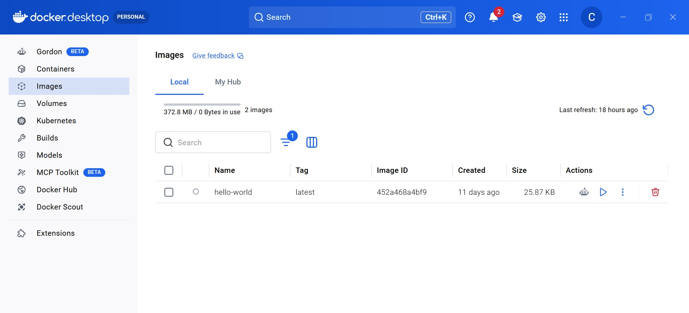
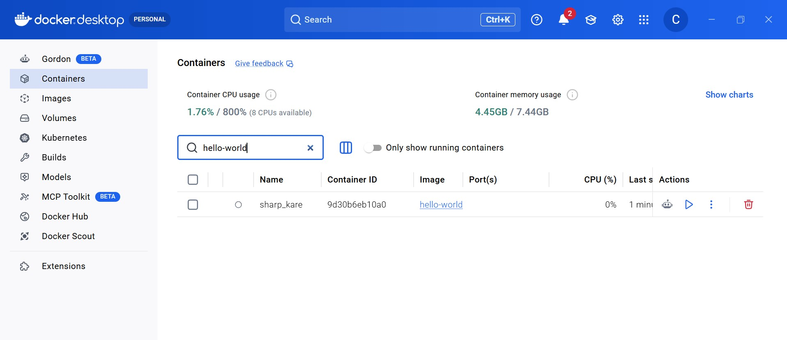

# Docker & Cassandra Setup Guide

---

## What is Docker?

We've already covered Docker conceptually - this is a quick recap of the core ideas before we put them to use. Docker is a tool that lets you run software inside a **container** - a lightweight, isolated environment that packages everything the software needs to run: the runtime, dependencies, configuration, and file system. The container runs the same way regardless of what machine it's on.

### Key Concepts

**Image**
An image is a blueprint for a container. It defines what software is installed, what files exist, and what runs when the container starts. Images are read-only - you don't modify them, you run them. Docker Hub is the public registry where most images live, including the official Cassandra image we'll use.

**Container**
A container is a running instance of an image. You can run multiple containers from the same image simultaneously, and each one is isolated from the others. When you stop and remove a container, the image is still there - you can spin up a new container from it at any time.

**Port Mapping**
A container creates its own isolated environment - including its own network. Just like on your own machine, software running inside a container can listen on a port. We've seen this with our Spring Boot applications, or with Artemis listening on a port, and now we'll see the same with Cassandra. But when that software runs inside a Docker container, it's listening on the container's port, not your machine's. Your machine has no idea it's there by default.

Port mapping is how you bridge the two. The flag `-p 9042:9042` tells Docker to forward anything arriving at port 9042 on your machine into port 9042 inside the container. Now when your ETL or reporting service connects to `localhost:9042`, Docker passes that traffic through to Cassandra. The two numbers don't have to match - but we keep them the same here to make it simple.

**docker run**
The command that creates and starts a container from an image. It's actually doing two things in sequence: first it pulls the image from Docker Hub if you don't already have it locally, then it creates and starts a container from that image. You'll see this play out step by step when you run it - Docker prints each layer it's downloading before the container starts.

**docker pull**
Pulls an image from Docker Hub to your machine without running it. Useful when you want the image locally ahead of time, or just want to browse what you have.

**docker exec**
Runs a command inside an already-running container. We use this to open a CQL shell inside the Cassandra container without installing Cassandra locally.

---

## Why Docker for Cassandra?

Cassandra is not a lightweight install. Running it natively requires a compatible JDK, specific environment variables, and a handful of configuration files - and the setup differs between Windows and Mac which adds even more complexity.

Docker sidesteps all of that. The official Cassandra image has everything pre-configured. You run one command and you have a fully operational Cassandra node running on your machine in under a minute, with no residue left behind when you're done with the project.

There's a deeper reason too: this mirrors how Cassandra runs in production. Nobody installs Cassandra directly on a server anymore - it runs in containers, orchestrated by Kubernetes or a managed cloud service. Getting comfortable with the Docker workflow now is getting comfortable with how real infrastructure works.

---

## Installation

### Windows

**Step 1 - Install Docker Desktop**

Download Docker Desktop from [docker.com/products/docker-desktop](https://www.docker.com/products/docker-desktop). Run the installer and follow the prompts.

During installation, Docker will ask about WSL 2 (Windows Subsystem for Linux). Leave the WSL 2 option enabled - Docker Desktop on Windows runs containers through WSL 2 and this is the recommended backend.

If prompted to install or update WSL 2, allow it. You may need to restart your machine after installation.

**Step 2 - Verify Docker is running**

After installation, Docker Desktop should launch automatically and show a whale icon in your system tray. Open a terminal (Git Bash, PowerShell or Command Prompt) and run:

```bash
docker --version
```

You should see a version number. If you get "command not found", make sure Docker Desktop is running (check the system tray) and try reopening your terminal.

**Step 3 - Pull the hello-world image**

Docker Hub is the public registry where images live. You can browse available images at [hub.docker.com](https://hub.docker.com) - everything from databases to web servers to language runtimes is there. We'll use it shortly to find the official Cassandra image.

For now, pull the `hello-world` image to your machine:

```bash
docker pull hello-world
```

You'll see Docker downloading the image layer by layer. Once it's done, open Docker Desktop and navigate to the **Images** tab - you should see `hello-world` listed there. This is the image sitting on your machine, not yet running.




**Step 4 - Create and run a container from the image**

```bash
docker run hello-world
```

This creates a container from the `hello-world` image and runs it. You'll see a confirmation message in the terminal. Now check the **Containers** tab in Docker Desktop - you'll see the container listed there, though it will already be stopped. That's expected: `hello-world` is a one-shot container. It ran, printed its message, and exited. It didn't listen on any port because it wasn't a long-running service - it just did its job and stopped.

Cassandra will be different. It's a database that needs to stay running and accept incoming connections, so we'll run it with a few extra flags to keep it alive in the background and expose its port.



---

### Mac

**Step 1 - Install Docker Desktop**

Download Docker Desktop from [docker.com/products/docker-desktop](https://www.docker.com/products/docker-desktop). Make sure you select the correct chip version - **Apple Silicon** if you have an M1/M2/M3 Mac, **Intel Chip** if you have an older Mac.

Open the `.dmg` file and drag Docker to your Applications folder. Launch Docker from Applications.

**Step 2 - Verify Docker is running**

Docker Desktop will show a whale icon in your menu bar when it's running. Open a terminal and run:

```bash
docker --version
```

You should see a version number. If not, make sure Docker Desktop is fully started - it can take 20–30 seconds on first launch.

**Step 3 - Pull the hello-world image**

Docker Hub is the public registry where images live. You can browse available images at [hub.docker.com](https://hub.docker.com) - everything from databases to web servers to language runtimes is there. We'll use it shortly to find the official Cassandra image.

For now, pull the `hello-world` image to your machine:

```bash
docker pull hello-world
```

You'll see Docker downloading the image layer by layer. Once it's done, open Docker Desktop and navigate to the **Images** tab - you should see `hello-world` listed there. This is the image sitting on your machine, not yet running.

**Step 4 - Create and run a container from the image**

```bash
docker run hello-world
```

This creates a container from the `hello-world` image and runs it. You'll see a confirmation message in the terminal. Now check the **Containers** tab in Docker Desktop - you'll see the container listed there, though it will already be stopped. That's expected: `hello-world` is a one-shot container. It ran, printed its message, and exited. It didn't listen on any port because it wasn't a long-running service - it just did its job and stopped.

Cassandra will be different. It's a database that needs to stay running and accept incoming connections, so we'll run it with a few extra flags to keep it alive in the background and expose its port.

---

## Running Cassandra

### Pull and start the Cassandra container

```bash
docker run -d --name cassandra -p 9042:9042 cassandra:latest
```

Notice we're not running `docker pull` first this time. When you run `docker run` with an image you don't have locally, Docker pulls it automatically before creating the container - you'll see it download layer by layer in your terminal, the same way it did for `hello-world`. You can also find the official Cassandra image on Docker Hub at [hub.docker.com/_/cassandra](https://hub.docker.com/_/cassandra) if you want to see what versions are available or read the documentation.

Breaking the command down:

| Flag | What it does |
|------|--------------|
| `-d` | Runs the container in the background (detached mode) |
| `--name cassandra` | Gives the container a name so you can reference it easily |
| `-p 9042:9042` | Maps port 9042 on your machine to port 9042 in the container |
| `cassandra:latest` | The image to use - Docker pulls this from Docker Hub if you don't have it |

Cassandra takes about 30–60 seconds to fully start up after the container is running. If you try to connect too early you'll get a connection refused error - just wait a moment and try again.

### Check that the container is running

```bash
docker ps
```

You should see your `cassandra` container listed with a status of `Up`.


### Open a CQL shell
Docker exec lets you run any command inside an already-running container. The full command is:


```bash
docker exec -it cassandra cqlsh
```

This runs `cqlsh` (the Cassandra query shell) inside your running container. The `-it` flags keep the session interactive. If Cassandra is still starting up you'll see a connection error - wait another 30 seconds and try again.

Windows / Git Bash users: Prefix the command with winpty to enable interactive terminal support:
```bash
winpty docker exec -it cassandra cqlsh
```

Once connected, you'll see a prompt:

```
Connected to Test Cluster at 127.0.0.1:9042
[cqlsh 6.x.x | Cassandra 4.x.x | CQL spec 3.x.x | Native protocol v5]
Use HELP for help.
cqlsh>
```

You're in - you're connected to Cassandra running in your docker container.

### Verify Cassandra is working

Run this in cqlsh to list existing keyspaces:

```sql
DESCRIBE KEYSPACES;
```

You should see the built-in Cassandra system keyspaces listed. This confirms your connection is live.

---

## Useful Docker Commands

Some helpful terminal commands to use with docker:

```bash
# See all running containers
docker ps

# See all containers including stopped ones
docker ps -a

# Stop the Cassandra container
docker stop cassandra

# Start it again later
docker start cassandra

# Remove the container entirely (image stays on your machine)
docker rm cassandra

# See images on your machine
docker images
```

> **Note:** Stopping a container does not delete it - `docker stop` just pauses it. `docker start` brings it back. Use `docker rm` only if you want to remove the container entirely. The Cassandra image will still be on your machine and you can create a new container from it with `docker run` again.

---

## Connecting from the ETL and Reporting Service

Both the Python ETL and the Java reporting service connect to Cassandra at `localhost:9042` - the same host and port you mapped when starting the container. No additional configuration is needed. As long as the container is running, your code can reach it.
