# Cassandra Basics & CQL

---

## Cassandra Query Language (CQL)

CQL is the language you use to interact with Cassandra. The syntax is intentionally similar to SQL - `CREATE TABLE`, `INSERT`, `SELECT` all look familiar. But the behavior is different in important ways, and those differences flow directly from the architecture we covered in the previous section.

Think of CQL as SQL with constraints. The constraints aren't arbitrary - they exist because Cassandra needs to know exactly which node to route your query to. If your query doesn't give Cassandra enough information to do that, it will either reject it or perform a slow full-cluster scan.

---

## Keyspace

A keyspace is Cassandra's equivalent of a database or schema in SQL. It's the top-level namespace that contains your tables, and it's where you configure replication.

```sql
CREATE KEYSPACE ecommerce_analytics
  WITH replication = {'class': 'SimpleStrategy', 'replication_factor': 1};
```

- **SimpleStrategy** - replication strategy for a single data center. Fine for local development.
- **replication_factor** - how many nodes store a copy of each partition. We use 1 here because we're running a single local node. In production this would be 3 or higher.

Switch into your keyspace before running any table commands:

```sql
USE ecommerce_analytics;
```

---

## Type

Cassandra has a rich type system. The most common types you'll use:

| CQL Type | Description | Java equivalent |
|---|---|---|
| `uuid` | Universally unique identifier | `UUID` |
| `text` | UTF-8 string | `String` |
| `int` | 32-bit integer | `int` |
| `boolean` | True/false | `boolean` |
| `timestamp` | Date and time with timezone | `Instant` |
| `date` | Date only, no time | `LocalDate` |
| `decimal` | Arbitrary precision decimal | `BigDecimal` |
| `list<T>` | Ordered list of values | `List<T>` |

You'll see `uuid` used for primary keys where you need a guaranteed unique identifier - an invoice ID, a customer ID, an event ID. Cassandra can generate UUIDs automatically using the `uuid()` function, or you can supply them from your application. You'll also see `list<text>` used in the demo to store item SKUs on an invoice - a clean fit when you have a variable-length collection that belongs to a single row.

---

## Table

This is where Cassandra diverges most sharply from SQL. The `CREATE TABLE` statement requires you to define a **primary key** that consists of:

- A **partition key** - determines which node the row lives on. All rows with the same partition key are stored together.
- Zero or more **clustering columns** - determine the sort order of rows within a partition.

```sql
CREATE TABLE ecommerce_analytics.invoices_by_customer (
    customer_id  TEXT,
    placed_at    TIMESTAMP,
    invoice_id   UUID,
    total        DECIMAL,
    item_skus    LIST<TEXT>,
    PRIMARY KEY  (customer_id, placed_at)
) WITH CLUSTERING ORDER BY (placed_at DESC);
```

Breaking down the primary key `(customer_id, placed_at)`:

- `customer_id` - the **partition key**. All invoices for the same customer live on the same node. When you query a customer's order history, Cassandra goes directly to that partition.
- `placed_at` - the **clustering column**. Within a customer's partition, invoices are sorted by placement time descending - newest first. This matches exactly how you'd want to display order history.

### Why no invoice_id as a clustering column here?

In this table, `placed_at` alone is sufficient to order rows. If two invoices were placed at exactly the same timestamp, you'd add `invoice_id` to break the tie - but for most real-world cases `placed_at` gives you the ordering you need. You'll see this trade-off in the demo.

### Composite partition keys

The `warehouse_queue` table in the demo introduces a more advanced concept - a **composite partition key**:

```sql
CREATE TABLE ecommerce_analytics.warehouse_queue (
    warehouse   TEXT,
    status      TEXT,
    invoice_id  UUID,
    placed_at   TIMESTAMP,
    customer_id TEXT,
    total       DECIMAL,
    PRIMARY KEY ((warehouse, status), invoice_id)
);
```

Notice the double parentheses around `(warehouse, status)` - that means both columns together form the partition key. A query needs to supply both to hit the right partition. This makes sense here because a warehouse picker always knows both their warehouse and the status they're working - `WHERE warehouse = 'CHI-1' AND status = 'ASSIGNED'` is the natural query. Splitting on just `warehouse` would put all statuses in one partition; splitting on just `status` would mix warehouses together. The composite key gives you a partition that maps exactly to one meaningful unit of work.

### invoice_events - partition key only, no composite key needed

Not every table needs composite keys or multiple clustering columns. `invoice_events` is a clean example of a simple partition key with one clustering column:

```sql
CREATE TABLE ecommerce_analytics.invoice_events (
  invoice_id  UUID,
  event_time  TIMESTAMP,
  status      TEXT,
  warehouse   TEXT,
  PRIMARY KEY (invoice_id, event_time)
) WITH CLUSTERING ORDER BY (event_time DESC);
```

`invoice_id` is the partition key - every event for the same invoice lands in the same partition. `event_time` is the clustering column - events within that partition are sorted newest first. The result: give me `invoice_id`, get back the full audit trail in order, in one partition read.

### The CLUSTERING ORDER clause

`WITH CLUSTERING ORDER BY (placed_at DESC)` means rows within a partition are stored on disk in descending time order. Cassandra reads are sequential on disk - storing in the order you query in (most recent first) makes reads faster. Always define your clustering order to match how you'll query.

---

## Why Three Tables?

This is the question to sit with. In SQL, you'd have one `invoices` table and write different queries against it. In Cassandra, if you need to serve multiple different access patterns, you design a table for each one. The demo uses three tables, each answering a different question:

| Table | Partition Key | Query it serves | Who uses it |
|---|---|---|---|
| `invoice_events` | `invoice_id` | Full event history for a specific invoice | Auditors, support |
| `invoices_by_customer` | `customer_id` | All invoices for a specific customer | Customer-facing order history |
| `warehouse_queue` | `(warehouse, status)` | All invoices currently assigned to a warehouse | Warehouse pickers |

You cannot query `invoices_by_customer` to see what a warehouse has queued - that data isn't organized that way. You need `warehouse_queue` for that. The data is duplicated across tables deliberately, because each table is purpose-built for one access pattern.



**This is the most common mistake engineers make coming from SQL: designing a Cassandra table like a SQL table and then wondering why the queries don't work.**

---

## Insert

```sql
INSERT INTO ecommerce_analytics.invoices_by_customer
    (customer_id, placed_at, invoice_id, total, item_skus)
VALUES
    ('cust-8821', '2026-04-06 09:15:00', 11111111-1111-1111-1111-111111111111, 209.92, ['SHOE-001', 'SOCK-004']);
```

A few things to note:

- You must supply values for all primary key columns
- Non-primary-key columns are optional - Cassandra won't complain if you omit them
- Cassandra `INSERT` behaves like an **upsert** - if a row with the same primary key already exists, it's overwritten silently. There is no duplicate key error.
- `uuid()` is a CQL function that generates a random UUID. In practice your application will usually generate the UUID and pass it in directly, rather than relying on Cassandra to generate it.
- List literals use square brackets: `['SHOE-001', 'SOCK-004']`

### DELETE

Unlike SQL where you might update a status column, in Cassandra status is often part of the partition key - which means you can't update it in place. You delete the row from the old partition and insert it into the new one. The demo shows this when an invoice ships out of the warehouse queue:

```sql
DELETE FROM warehouse_queue
WHERE warehouse = 'CHI-1'
AND status = 'ASSIGNED'
AND invoice_id = 11111111-1111-1111-1111-111111111111;
```

This is the append-only mindset Cassandra encourages - events are recorded, states are replaced, nothing is mutated.

---

## Select

```sql
-- All invoices for a specific customer
SELECT * FROM ecommerce_analytics.invoices_by_customer
WHERE customer_id = 'cust-8821';

-- Everything currently assigned to a warehouse
SELECT * FROM ecommerce_analytics.warehouse_queue
WHERE warehouse = 'CHI-1' AND status = 'ASSIGNED';

-- Full event trail for a specific invoice
SELECT * FROM ecommerce_analytics.invoice_events
WHERE invoice_id = 11111111-1111-1111-1111-111111111111;
```

### The rules of SELECT in Cassandra

**You must always specify the full partition key.** Cassandra needs to know which node to go to. A query without a partition key is a full cluster scan - Cassandra will either reject it or warn you that it's inefficient.

**You can filter on clustering columns, but only in order.** If your clustering columns are `(placed_at, invoice_id)`, you can filter on `placed_at` alone, but you cannot filter on `invoice_id` without also specifying `placed_at`. Cassandra reads clustering columns left to right.

**You cannot filter on non-key columns without ALLOW FILTERING.** Adding `ALLOW FILTERING` to a query tells Cassandra to scan all rows in the matching partition and filter in memory. This works on small partitions but is dangerous on large ones. In production, if you find yourself reaching for `ALLOW FILTERING`, it usually means you need a new table designed for that access pattern.

```sql
-- This works - full partition key supplied
SELECT * FROM invoices_by_customer WHERE customer_id = 'cust-8821';

-- This works - filtering on clustering column
SELECT * FROM invoices_by_customer WHERE customer_id = 'cust-8821' AND placed_at > '2026-04-06 00:00:00';

-- This requires ALLOW FILTERING - total is not a key column
SELECT * FROM invoices_by_customer WHERE customer_id = 'cust-8821' AND total > 100 ALLOW FILTERING;
```

---

## Creating and Populating a Cassandra DB - End to End

The demo walkthrough covers this in full detail with two invoices from the same customer moving through placed, assigned, and shipped states. Here's the high-level sequence and what to pay attention to at each step.

### Step 1 - Create the keyspace and tables

```sql
CREATE KEYSPACE ecommerce_analytics
  WITH replication = {'class': 'SimpleStrategy', 'replication_factor': 1};

USE ecommerce_analytics;

DROP TABLE IF EXISTS invoice_events;
DROP TABLE IF EXISTS invoices_by_customer;
DROP TABLE IF EXISTS warehouse_queue;

CREATE TABLE invoice_events (
  invoice_id  UUID,
  event_time  TIMESTAMP,
  status      TEXT,
  warehouse   TEXT,
  PRIMARY KEY (invoice_id, event_time)
) WITH CLUSTERING ORDER BY (event_time DESC);

CREATE TABLE invoices_by_customer (
  customer_id  TEXT,
  placed_at    TIMESTAMP,
  invoice_id   UUID,
  total        DECIMAL,
  item_skus    LIST<TEXT>,
  PRIMARY KEY  (customer_id, placed_at)
) WITH CLUSTERING ORDER BY (placed_at DESC);

CREATE TABLE warehouse_queue (
  warehouse   TEXT,
  status      TEXT,
  invoice_id  UUID,
  placed_at   TIMESTAMP,
  customer_id TEXT,
  total       DECIMAL,
  PRIMARY KEY ((warehouse, status), invoice_id)
);
```

Verify all three tables created:

```sql
DESCRIBE TABLES;
```

### Step 2 - Write amplification in action

When invoice 1 is placed, it touches two tables. When it's assigned, it touches two more. One business event, multiple writes - this is intentional:

```
Invoice placed   -> invoice_events + invoices_by_customer
Invoice assigned -> invoice_events + warehouse_queue
Invoice shipped  -> invoice_events + DELETE from warehouse_queue
```

The cost is paid once at write time. Every subsequent read is a direct partition hit.

### Step 3 - The payoff query

After both invoices are inserted, a single query retrieves the full customer order history from one partition:

```sql
SELECT * FROM invoices_by_customer
WHERE customer_id = 'cust-8821';
```

Both invoices come back, newest first, from a single node. No scan, no join, no broadcast. This is what the schema design was optimizing for.

---

## Table Design - Best Practices

Pulling together everything from both sessions:

**Model your queries, not your entities.** Start with the question "what does this query need to answer?" before you write a single `CREATE TABLE`.

**Choose partition keys with even distribution in mind.** A partition key that concentrates too many rows on one node creates a **hot partition** - one node does all the work while the others sit idle. `customer_id` as a partition key works well because invoices are spread across many customers. Using `status` alone as a partition key would be a bad choice - only a handful of status values means a few nodes do all the work. The demo handles this by making `(warehouse, status)` a composite partition key, splitting the load across warehouses.

**Keep partitions reasonably sized.** Cassandra recommends partitions stay under a few hundred megabytes. If a single partition key value will produce millions of rows, consider adding a bucketing column to split it - so instead of partitioning by `customer_id` alone you'd partition by `(customer_id, invoice_month)`.

**Clustering columns control sort order and filter options.** Define them in the order you'll query them. The order matters both for what filters are allowed and how fast reads are.

**Duplicate data freely.** The storage cost of duplication is cheap. The performance cost of a bad partition key or a missing table is not.

**Never design a table you can't query by partition key.** If you can't write a `SELECT` that includes the full partition key, the table isn't useful.

**Status changes are delete + insert, not update.** When status is part of the partition key, you can't mutate it in place. Remove the row from the old partition and insert it into the new one. This keeps your data consistent and your partitions clean.

**ALLOW FILTERING is a code smell.** In a production system, reaching for `ALLOW FILTERING` means you've hit an access pattern your schema doesn't support. The fix is a new table, not a slower query.
