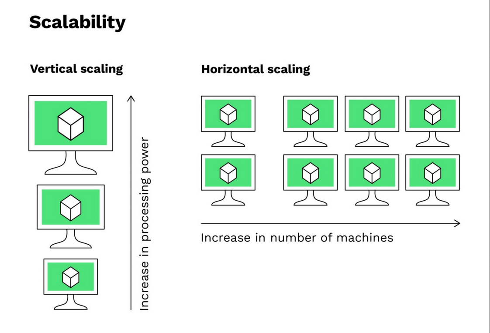

# NoSQL & Cassandra Orientation

---

## NoSQL Introduction

You've been working with relational databases - tables, rows, foreign keys, joins. SQL databases are built around the idea that data has a rigid, predefined shape, and that relationships between entities are navigated at query time through joins.

NoSQL databases challenge that assumption. "NoSQL" doesn't mean "no query language" - it means "not only SQL." It's an umbrella term for a family of databases that store and retrieve data differently, each optimized for a specific kind of problem.

### Why NoSQL Exists

Relational databases were designed in an era when data fit on one machine. Scaling a relational database vertically - adding more CPU and RAM to a single server - works up to a point, but it's expensive and has a ceiling.

NoSQL databases were designed to scale **horizontally** - spread data across many commodity machines. When you need more capacity, you add more nodes. The trade-off is that you give up some of the guarantees SQL databases provide, particularly around joins and transactions.



### NoSQL vs SQL

| | SQL | NoSQL |
|---|---|---|
| Schema | Fixed, predefined | Flexible or schema-free |
| Scaling | Vertical (bigger machine) | Horizontal (more machines) |
| Relationships | Joins at query time | Denormalized, duplicated |
| Transactions | ACID guarantees | Varies by database |
| Best for | Complex relationships, reporting | High volume, distributed, fast reads |

The key mental shift: in SQL you normalize data to avoid duplication. In NoSQL you often **intentionally duplicate** data to support the queries you need. This feels wrong at first - we'll see exactly why it's necessary when we get to Cassandra table design.

---

## NoSQL vs SQL - Deeper

One of the most common interview questions you'll encounter: **when would you choose NoSQL over SQL?**

The honest answer is that it depends on your access patterns. SQL is a better fit when:
- Your data has complex relationships you need to navigate flexibly
- You need strong transactional consistency
- Your query patterns are unpredictable or ad hoc

NoSQL is a better fit when:
- You know exactly how your data will be queried
- You need to handle massive write or read throughput
- You need to distribute data across multiple geographic regions
- Schema flexibility matters (e.g. each record might have different fields)

These aren't mutually exclusive - large systems often use both. An e-commerce platform might use a relational database for orders, customers, and inventory, and a NoSQL store for product catalogs, session data, or high-volume event tracking.

---

## Types of NoSQL Databases

NoSQL is not a single thing - it's a category. There are four main families, each with a different data model and a different set of problems it's good at.

### Document Stores

Document stores save data as self-contained documents, typically JSON or BSON. Each document can have a different structure - there's no requirement that every record has the same fields. You query by document ID or by fields inside the document.

**Best for:** content management, user profiles, product catalogs, anything where each record has a variable or evolving shape.

**Examples:** MongoDB, CouchDB, Firestore

```json
{
  "productId": "p-8821",
  "name": "Wireless Headphones",
  "brand": "SoundCore",
  "specs": {
    "batteryLife": "30hrs",
    "bluetooth": "5.2"
  },
  "tags": ["electronics", "audio", "wireless"]
}
```

A product catalog is a classic document store use case - a t-shirt and a laptop have completely different attributes, and a document store handles that naturally where a SQL table would require nullable columns or awkward joins.

### Key-Value Stores

The simplest NoSQL model. Data is stored as a flat map of keys to values. The value is opaque to the database - it could be a string, a number, a blob of JSON, anything. Lookups are always by key. There's no querying by value, no filtering, no sorting.

**Best for:** caching, session storage, real-time leaderboards, anything where you always know exactly what you're looking for.

**Examples:** Redis, DynamoDB (in its simplest usage), Memcached

```
"session:abc123" -> "{customerId: 'c-7741', expires: '2026-03-17T10:00:00Z'}"
"product:p-8821:stock" -> "142"
"cart:abc123:total" -> "89.97"
```

Redis is the canonical example - it lives in memory and is extraordinarily fast. You'll see it used as a cache layer in front of slower databases, or for things like rate limiting and pub/sub messaging.

### Wide-Column Stores

This is where Cassandra lives. Wide-column stores organize data into tables with rows and columns, but unlike SQL, the columns are not fixed across all rows - each row can have a different set of columns. More importantly, data is partitioned and distributed by a partition key, and rows within a partition are sorted by clustering columns.

**Best for:** time-series data, event logs, high-volume write workloads, anything where you query by a known key and need rows returned in sorted order.

**Examples:** Apache Cassandra, HBase, Google Bigtable

The "wide" in wide-column refers to the fact that a single row can have an extremely large number of columns - potentially millions - without that being defined upfront. In practice with Cassandra, the more important concept is the partition: all rows sharing a partition key are stored contiguously on disk on the same node, which is what makes reads so fast.

Think about an e-commerce platform's order history. Orders are written at high volume, you always know what you're querying by (customer, date, product category), and you want results returned in time order. Wide-column is the right fit for that kind of workload.

### Graph Databases

Graph databases store data as nodes and edges - entities and the relationships between them. Where SQL represents relationships through foreign keys and joins, a graph database makes relationships a first-class citizen. Traversing relationships (e.g. "find all friends of friends of this user who have also purchased this product") is fast because the connections are stored directly rather than computed at query time.

**Best for:** social networks, recommendation engines, fraud detection, any domain where the relationships between things are as important as the things themselves.

**Examples:** Neo4j, Amazon Neptune, ArangoDB

```
(Customer)-[:PURCHASED]->(Product)-[:BELONGS_TO]->(Category)
(Customer)-[:ALSO_VIEWED]->(Product)
```

Graph databases are less common in general application development but show up heavily in fraud detection (finding suspicious patterns in transaction networks) and recommendation systems (finding what products people with similar purchase histories bought).

### Comparison at a Glance

| Type | Model | Strength | Example Use Case |
|---|---|---|---|
| Document | JSON documents | Flexible schema, rich queries | User profiles, CMS |
| Key-Value | Flat key-to-value map | Extreme speed, simplicity | Caching, sessions |
| Wide-Column | Partitioned rows + sorted columns | High-volume writes, time-series | Event logs, call records |
| Graph | Nodes and edges | Relationship traversal | Fraud detection, social graphs |

---

## Cassandra Orientation

### What is Apache Cassandra?

Apache Cassandra is an open-source, distributed NoSQL database originally developed at Facebook to power their inbox search feature. It was designed from the ground up to handle massive amounts of data across many nodes with no single point of failure.

Cassandra belongs to the **wide-column store** family. Data is organized into tables with rows and columns - so it looks somewhat familiar coming from SQL - but the similarity ends at the surface. Columns are not uniform across rows, primary keys work very differently, and there are no joins. What makes Cassandra a wide-column store is how data is physically organized: rows are grouped into partitions by a partition key, and within each partition rows are stored in sorted order by clustering columns. The database is optimized to write and read entire partitions very fast.

### Cassandra vs DynamoDB

Both are wide-column, distributed NoSQL databases built for high availability and scale. The key differences:

| | Cassandra | DynamoDB |
|---|---|---|
| Hosting | Self-managed or cloud (Astra) | AWS managed service only |
| Pricing | Open source, free to run | Pay per read/write/storage |
| Query language | CQL (SQL-like syntax) | API-based, less expressive |
| Operational overhead | You manage the cluster | AWS manages everything |
| Portability | Run anywhere | AWS lock-in |

In practice, DynamoDB is the choice when you're already in AWS and don't want to manage infrastructure. Cassandra is the choice when you need portability, have existing ops expertise, or are running on-premise. The data modeling principles are nearly identical - what you learn about Cassandra partition design applies directly to DynamoDB.

---

## Cassandra Architecture

This is the most important section to understand before you write a single line of CQL. Table design in Cassandra is inseparable from architecture - if you don't understand how data is distributed, you can't design tables correctly.

### The Ring

Cassandra distributes data across nodes using a **ring architecture**. Every node in a Cassandra cluster is assigned a range of token values. When you write a record, Cassandra hashes the partition key to produce a token, then routes that write to the node responsible for that token range.



Every node is equal - there is no primary node, no leader. This is what gives Cassandra its high availability. Any node can accept any read or write request.

### Partitions

A **partition** is the fundamental unit of data storage and distribution in Cassandra. All rows that share the same partition key are stored together on the same node. This is both the source of Cassandra's performance and the constraint that drives all table design decisions.

When you read data, Cassandra can go directly to the node that owns that partition and retrieve all matching rows in a single, fast operation. There is no scanning across nodes, no joins across partitions. The read is fast because **you already told Cassandra where the data lives** through your partition key choice.



This means:
- Queries **must** include the partition key
- Queries that don't specify a partition key require a full cluster scan - slow and expensive
- All rows you want to retrieve together **must share the same partition key**

### Replication

Cassandra copies each partition to multiple nodes based on the **replication factor**. With `replication_factor: 3`, every partition is stored on three nodes. If one node goes down, the other two still have the data.

The replication factor is set per keyspace when you create it - which is why you'll see it in the `CREATE KEYSPACE` statement.

### Consistency Levels

Because data is replicated, Cassandra gives you control over how many nodes must agree before a read or write is considered successful. This is the **consistency level**.

- `ONE` - only one replica needs to respond. Fastest, lowest consistency guarantee.
- `QUORUM` - a majority of replicas must respond. Balances performance and consistency.
- `ALL` - every replica must respond. Strongest consistency, least available.

For ClearCall we use `SimpleStrategy` with `replication_factor: 1` because we're running locally on a single node. In production you'd use `NetworkTopologyStrategy` with a replication factor of at least 3.

### Key-Value System

At its core, Cassandra is a key-value system. The partition key is the key, and everything stored under that key is the value. The "wide column" part means that value can contain many columns organized into rows, sorted by clustering keys - but the fundamental lookup is always: **give me everything under this partition key**.

This is why Cassandra is fast: reads and writes go directly to the right node, retrieve contiguous data, and return. There is no optimizer figuring out a query plan, no join engine, no index scan. You do that work upfront by designing your schema around your queries.

### CQLSH

`cqlsh` is the Cassandra Query Language shell - the interactive terminal for running CQL commands against a Cassandra node. It's analogous to the MySQL shell or `psql` for Postgres. You'll use it to create your keyspace, create tables, and verify your data after the ETL runs.

---

## Cassandra Set-Up

See the **Docker & Cassandra Setup Guide** for full installation and startup instructions. The short version:

```bash
# Start Cassandra in Docker
docker run -d --name cassandra -p 9042:9042 cassandra:latest

# Open a CQL shell inside the container
docker exec -it cassandra cqlsh
```

---

## Table Design - The Core Principle

Before moving on to CQL syntax, internalize this:

> **In Cassandra, you design tables around queries, not around entities.**

In SQL, you model your entities - agents, calls, categories - normalize them, and then write whatever queries you need. The query engine figures out how to retrieve the data.

In Cassandra, you start with the queries you need to answer, and you design a table specifically to serve each one. If you need to query calls by date and also by agent, you don't join two tables - you create two tables, each storing the same data organized differently.

This duplication is **intentional and correct**. It is not a sign of bad design. It is the design.

The questions to ask before creating any table:
1. What is the query this table needs to serve?
2. What value will always be in my `WHERE` clause? That's your partition key.
3. Within a partition, how do I want rows ordered or filtered? Those are your clustering columns.
4. What data does the query need to return? Those are your regular columns.

We'll put this into practice in the next section when we write the ClearCall schema.
