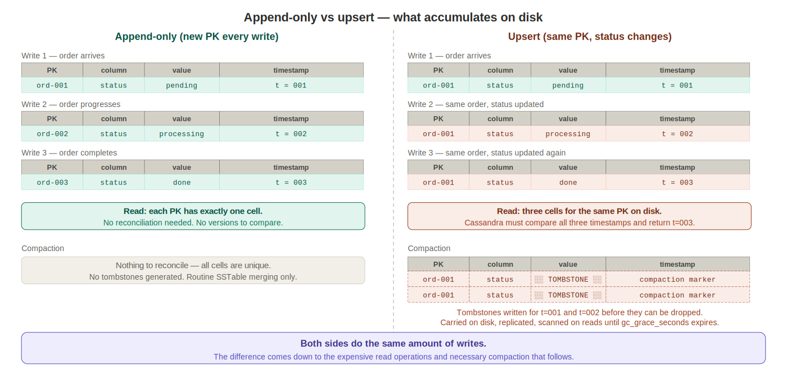

# Advanced CQL

---


## DDL - Beyond the Basics

Earlier this week we covered `CREATE KEYSPACE` and `CREATE TABLE` as the foundation of defining a Cassandra schema. There are a few more DDL operations worth knowing.

**Altering a table** - columns can be added or dropped after the table exists, but the primary key cannot be changed once it's set:

```sql
ALTER TABLE invoices_by_customer ADD promo_code TEXT;
ALTER TABLE invoices_by_customer DROP promo_code;
```

Dropping a column removes the data permanently. Renaming columns is not supported in CQL - if a different name is needed, drop the column and recreate it.

One naming gotcha to keep in mind: CQL has a long list of reserved words that can't be used as column or table names without quoting. Common offenders are `type`, `token`, `timestamp`, `list`, `map`, `set`, `time`, and `value`. If you hit an unexpected syntax error on a `CREATE TABLE`, check the column names first. The fix is either double-quoting the name (`"type"`) or - better - choosing a more specific name like `call_type` or `event_type` from the start.

**User-Defined Types (UDT)** - CQL lets you define custom types and use them as column types, similar to an embedded object. This is useful when a group of fields logically belong together and you'd otherwise be flattening them into separate columns or reaching for a map.

```sql
-- Define the type
CREATE TYPE ecommerce_analytics.address (
    street TEXT,
    city   TEXT,
    state  TEXT,
    zip    TEXT
);

-- Use it as a column type
CREATE TABLE ecommerce_analytics.customers (
    customer_id  TEXT PRIMARY KEY,
    name         TEXT,
    shipping     FROZEN<address>,
    billing      FROZEN<address>
);

-- Insert using the type literal
INSERT INTO customers (customer_id, name, shipping, billing)
VALUES (
    'cust-8821',
    'Alex Rivera',
    { street: '123 Main St', city: 'Chicago', state: 'IL', zip: '60601' },
    { street: '456 Oak Ave', city: 'Chicago', state: 'IL', zip: '60602' }
);

-- Read back - address fields come back as a nested object
SELECT name, shipping.city, billing.zip FROM customers WHERE customer_id = 'cust-8821';
```

`FROZEN` means the entire UDT value is serialized as a single blob - individual fields inside it can't be updated, only the whole value replaced.

In the Python driver, UDT values come back as named tuples, so `row.shipping.city` works as expected. For a contact center use case, a UDT is a natural fit for things like call metadata, agent profile details, or structured disposition codes that travel with every record.

---

## DML - Continued

**UPDATE** - syntactically familiar, but worth understanding what Cassandra actually does with it. Like `INSERT`, `UPDATE` is an upsert - if the row doesn't exist, Cassandra creates it. There is no "row not found" error. And if the row does exist, Cassandra isn't checking for that either. Both keywords do the exact same thing at the storage level: write a new timestamped cell to disk. 

```sql
UPDATE invoices_by_customer
SET total = 219.92
WHERE customer_id = 'cust-8821'
AND placed_at = '2026-04-06 09:15:00';
```

Only non-primary-key columns can be updated. More importantly, Cassandra is not optimized for updates. It thrives on writes that are appends - new rows landing in the right partition - not mutations to existing rows. Every update writes a new version of the cell with a higher timestamp alongside the old one. The old cell doesn't disappear - it sits on disk as a shadowed version until compaction runs. At read time, Cassandra has to look across all those versions and reconcile them to find the winner. And when compaction eventually cleans up those superseded cells, it has to write tombstones for them - the same kind generated by explicit deletes - which get replicated, carried on disk, and scanned through on reads until they can be safely dropped. 

Heavy update patterns mean more reconciliation on every read and more tombstone pressure over time. This is the tradeoff Cassandra asks you to make consciously: it is better to carry more data on disk than to accept the ongoing cost of reconciliation on reads and compaction cleanup. Disk is cheap; read latency is not.




The right question to ask before reaching for `UPDATE` is: does this data actually change, or should a new event be recorded instead? In the invoice demo, when an invoice ships we don't update a `status` column - we append a new event to `invoice_events`. That is the Cassandra-native pattern. Reserve `UPDATE` for genuinely mutable non-key fields where there is no better option - correcting a total after a pricing error, or updating a display name.

**Lightweight Transactions (LWT)** - Cassandra's conditional write support, using `IF`:

```sql
-- Only insert if this row doesn't already exist
INSERT INTO invoices_by_customer (customer_id, placed_at, invoice_id, total)
VALUES ('cust-8821', '2026-04-06 09:15:00', uuid(), 209.92)
IF NOT EXISTS;

-- Only update if the current value matches
UPDATE invoices_by_customer
SET total = 219.92
WHERE customer_id = 'cust-8821' AND placed_at = '2026-04-06 09:15:00'
IF total = 209.92;
```

What an LWT guarantees: the read and the write happen atomically on a single partition. No other write can occur between them. If two services both try to insert the same row simultaneously, exactly one will succeed and the other will get back `applied: false`.

What an LWT does not guarantee: anything across partitions. It is scoped to one partition, one table, one operation - it has nothing to say about what is happening in any other table or any other partition.

LWTs are appropriate anywhere a race condition on a single row would cause a real problem - an agent claiming a call where only one agent should get it, or deducting from a balance where double-processing would be harmful. The `IF NOT EXISTS` form is the most common: a safe insert that fails gracefully if something already wrote that row.

Outside of those specific cases, LWTs should be avoided. They use a Paxos consensus round internally, which means four network round-trips instead of one - roughly 4–10x slower than a normal write. If a design requires LWTs on every write, the schema or the application logic needs rethinking.

**BATCH** - grouping multiple statements to be sent together:

```sql
-- Good use: multiple rows into the same partition
BEGIN BATCH
  INSERT INTO invoices_by_customer (customer_id, placed_at, invoice_id, total)
    VALUES ('cust-8821', '2026-04-06 09:15:00', uuid(), 209.92);
  INSERT INTO invoices_by_customer (customer_id, placed_at, invoice_id, total)
    VALUES ('cust-8821', '2026-04-06 11:30:00', uuid(), 84.50);
APPLY BATCH;
```

All statements in a batch are sent to the coordinator in one round-trip, and within a single partition they are applied atomically - both rows above either land together or neither does.

Batches make sense when loading multiple rows into the same partition at once - several invoices for the same customer, or a bulk load of events for the same `invoice_id`. The benefit is tied to the statements sharing a partition.

Batches across different partitions or different tables are not atomic. Each statement gets routed to its own node, and there is no rollback - if one statement fails and another succeeds, they stay inconsistent. Batching across tables or partitions also adds coordinator overhead because the coordinator must fan out to multiple nodes. For the write-amplification pattern - writing the same business event to `invoice_events` and `invoices_by_customer` simultaneously - two separate async writes from the application are usually the better choice, since the batch coordinator becomes a bottleneck at scale.

**Fault tolerance without transactions - idempotency** - since Cassandra provides no multi-table atomicity, the question becomes: what happens if a write partially succeeds, or if the application crashes mid-operation and retries? The answer is to design writes to be idempotent - meaning running the same write twice produces the same result as running it once. Cassandra's upsert behavior makes this natural. An `INSERT` with the same primary key overwrites the existing row with identical data. A `DELETE` on a row that's already gone is a no-op. If an ETL pipeline fails halfway through and replays the same batch of events, or if a message is delivered twice from a queue, Cassandra handles it safely - no duplicate rows, no corrupted state. This is the practical substitute for transactions in an eventually consistent system: design operations that can be safely repeated, and let retries happen freely.

---

## Arithmetic Operators

CQL supports standard arithmetic operators in two places: `SELECT` projections and `UPDATE` assignments.

**In SELECT - computing values on the way out:**

```sql
-- Number arithmetic: +, -, *, /, %
SELECT invoice_id, total, total * 1.08 AS total_with_tax FROM invoices_by_customer
WHERE customer_id = 'cust-8821';

-- Works on integers too
SELECT invoice_id, quantity, quantity * unit_price AS line_total FROM order_lines
WHERE order_id = ?;
```

```sql
SELECT total + shipping_cost AS total_with_shipping
FROM invoices_by_customer
WHERE customer_id = 'cust-8821'
AND placed_at = '2026-04-06 09:15:00';
```


**Datetime arithmetic** - Cassandra's `duration` type supports adding and subtracting time:

```sql
-- duration literal: shorthand like 7d, 30m, 1mo
SELECT * FROM invoice_events
WHERE invoice_id = ?
AND event_time > toTimestamp(now()) - 7d;
```

`duration` uses years (`y`), months (`mo`), days (`d`), hours (`h`), minutes (`m`), seconds (`s`). The ISO 8601 form is also supported: `P1Y2M3DT4H5M6S`. For most ETL work date math will happen in Python and pre-computed timestamps will be passed to CQL - but the `duration` syntax is useful for range queries directly in cqlsh.

---

**TTL (Time-To-Live)** - Cassandra can automatically expire rows after a set number of seconds. TTL is a good fit when the data has a natural expiration that's known at write time and you don't want to manage cleanup yourself.

Two concrete use cases: a password reset token table where each token should be invalid after 15 minutes - insert the token with a 900-second TTL and it disappears automatically, no cleanup job needed. Or an agent availability table in ClearCall where an agent's status record should expire if they haven't sent a heartbeat in 60 seconds - Cassandra removes the row automatically, which is cleaner than trying to detect stale rows in application code.

```sql
-- Token expires in 15 minutes
INSERT INTO password_reset_tokens (user_id, token, created_at)
VALUES ('user-001', 'abc123', toTimestamp(now()))
USING TTL 900;

-- Check how many seconds remain on a row
SELECT TTL(token) FROM password_reset_tokens WHERE user_id = 'user-001';
```

When the TTL expires, Cassandra marks the data as a tombstone and physically removes it during the next compaction cycle. TTL can be set per-row at insert time or as a table-wide default in `CREATE TABLE`.

---

## Dynamic Data Masking (DDM)

DDM lets you attach a masking function to a column so that unauthorized roles see a redacted value at query time. The underlying data is stored unmasked - the mask is applied on read, not on write.

This is a Cassandra 4.x feature and is directly relevant to any table storing PII like phone numbers, agent IDs, or customer contact details in ClearCall.

**Applying a mask when creating a table:**

```sql
CREATE TABLE clearcall.call_records (
    call_id      UUID,
    agent_id     TEXT,
    caller_phone TEXT MASKED WITH DEFAULT,   -- masked for unauthorized roles
    duration_sec INT,
    PRIMARY KEY (agent_id, call_id)
);
```

`MASKED WITH DEFAULT` uses the built-in default mask for the column's type - `****` for text, `0` for numeric types, `1970-01-01` for dates.

**Built-in masking functions:**

```sql
-- Mask with type default ('****' for text)
caller_phone TEXT MASKED WITH DEFAULT

-- Always return null
caller_phone TEXT MASKED WITH mask_null()

-- Return a fixed literal
caller_phone TEXT MASKED WITH mask_literal('REDACTED')

-- Partial mask - keep first N chars, mask the rest
caller_phone TEXT MASKED WITH mask_partial_text(3, '*')
-- '555-867-5309' becomes '555-*********'

-- Random value within a range (useful for numeric columns)
duration_sec INT MASKED WITH mask_random(0, 999)
```

**Granting unmask permission to a role:**

```sql
GRANT SELECT ON TABLE clearcall.call_records TO analyst_role;
GRANT UNMASK ON TABLE clearcall.call_records TO analyst_role;

-- A role without UNMASK sees:
-- call_id | agent_id | caller_phone | duration_sec
-- --------+----------+--------------+-------------
-- ...     | agent-01 | ****         | 0

-- A role with UNMASK sees:
-- call_id | agent_id | caller_phone   | duration_sec
-- --------+----------+----------------+-------------
-- ...     | agent-01 | 555-867-5309   | 342
```

**Adding or removing a mask on an existing column:**

```sql
ALTER TABLE clearcall.call_records
ALTER caller_phone MASKED WITH mask_partial_text(3, '*');

ALTER TABLE clearcall.call_records
ALTER caller_phone DROP MASKED;
```

DDM is not encryption and is not access control over whether a role can query the table at all - that is handled by `GRANT SELECT`. DDM only controls whether the role sees real values or masked ones when they do query. A role without `UNMASK` can still run `SELECT *` - they just get the masked output.

---

## Indexes

An index is a sorted, in-memory structure that maps a column's values to the rows that contain them. Instead of scanning every row to find where `status = 'ASSIGNED'`, Cassandra can jump straight to the right entries in the index and retrieve only the matching rows. The tradeoff is that every write must now update both the table and the index - indexes are never free.

The problem they solve: a table partitioned by `customer_id` has no direct path to a row by `invoice_id` alone. Without an index, that requires scanning the entire cluster. An index gives Cassandra a route to those rows without a full scan.

### Secondary Indexes

Both 2i and SAI let you query by a column that isn't the partition key. Without one, a query on a non-partition column forces a full cluster scan — Cassandra will either reject it or require `ALLOW FILTERING` as an explicit acknowledgment that you know what you're doing.

One thing both types share: **every node gets involved on every indexed query.** Without a partition key to route the request, the coordinator has to ask all nodes for their local matches and assemble the results. That's the nature of secondary indexes in a distributed system, not a flaw of either type specifically.

### 2i (Legacy)

```sql
CREATE INDEX ON invoices_by_customer (invoice_id);
```

Stores the index as a hidden internal table decoupled from the actual data. This causes two problems: range queries (`WHERE total > 100`) don't work cleanly, and the index can drift out of sync with the underlying data during compaction. It works, but it's the old approach. You'll see it in existing codebases - don't reach for it in new code.

### SAI - Storage-Attached Index (Cassandra 4.1+)

```sql
CREATE CUSTOM INDEX ON invoices_by_customer (total)
USING 'StorageAttachedIndex';
```

Stores index files directly alongside the table on each node. When a new table is written, its SAI index is written with it. When it's compacted, the index goes with it. Because they're attached to the same storage, range queries on numeric and date columns work naturally and there's no drift problem.

**If you're on Cassandra 4.1+, use SAI. 2i exists so you recognize it when you see it.**

**When an index makes sense:** when a column has high cardinality - many distinct values - and queries against it return a small result set. Something like invoice_id on a table partitioned by customer_id is a good candidate: there are millions of distinct invoice IDs, and a query for one specific ID returns exactly one row. Every node still gets involved, but each node's local index lookup returns nothing or one result - the scatter-gather is cheap because the result set is tiny.

**When an index is a bad idea:** low cardinality columns like status with only a handful of possible values. A query for WHERE status = 'ASSIGNED' might match a huge portion of every node's local data; you've done a full cluster scan and gotten a massive result set. The index bought you nothing. Low cardinality access patterns are better solved by table design, which is exactly what warehouse_queue does - status is part of the partition key, so WHERE warehouse = 'CHI-1' AND status = 'ASSIGNED' is a direct partition hit with no index needed.

---

## Materialized Views

A Cassandra materialized view is a physically separate copy of the data from a table, stored on disk, organized under a different primary key. Cassandra keeps it in sync automatically as writes come in to the base table.

```sql
CREATE MATERIALIZED VIEW invoices_by_invoice_id AS
    SELECT * FROM invoices_by_customer
    WHERE invoice_id IS NOT NULL
      AND customer_id IS NOT NULL
      AND placed_at IS NOT NULL
PRIMARY KEY (invoice_id, customer_id, placed_at);
```

The `WHERE` clause declaring all primary key columns as not null is required syntax, not a filter.

Materialized views are, however, an anti-pattern relative to the design principles we've built on all week. The core principle is that each access pattern gets its own table, written to explicitly from the application. A materialized view is Cassandra trying to automate that second write - and automatic comes with hidden costs.

Every write to the base table triggers a read-before-write on the replica holding the view partition to check for conflicts, roughly doubling write latency. The view is also only eventually consistent with the base table - there is a window where the two are out of sync. In older Cassandra versions this window was wide enough to cause real consistency bugs, and many production teams abandoned MVs entirely as a result.

Explicit write amplification - one `INSERT` per table per business event from application code - is more predictable, easier to reason about, and easier to debug. MVs are worth understanding, but the instinct to design the right table and write to it explicitly is the correct one.

---

## Functions

### Built-in Functions

Before defining your own functions, Cassandra provides a set of system functions available out of the box. The most useful ones fall into a few categories:
- **Type conversion** — **now()** generates a new timeuuid based on the current time, and **toTimestamp(now())** is the common pairing to get the current time as a usable timestamp. **uuid()** generates a random UUID directly in CQL without needing the application to supply one.
- **Aggregates** — **count(*)**, **sum()**, **avg()**, **min()**, and **max()** work as you'd expect from SQL, with one Cassandra-specific constraint: they only operate within a single partition. You must supply the partition key.
- **Inspection** — **TTL(column)** returns the remaining seconds before a column expires, and **writetime(column)** returns the microsecond timestamp of when a column was last written. Both are useful for debugging and verifying that data landed the way you expected.

### User-Defined Functions

Cassandra is written in Java and runs on the JVM. That's relevant here because extension code - UDFs and triggers - gets loaded directly into the Cassandra process and runs inside it. Java is therefore the primary supported language for both. UDFs also technically support JavaScript via the Nashorn engine, but that support is considered legacy and was removed in newer Java versions. For anything production-bound, Java is the language for Cassandra extension code.

**User-Defined Functions (UDF)** - scalar transformations applied per row in a query. Requires enabling in `cassandra.yaml` first:

```yaml
enable_user_defined_functions: true
```

```sql
CREATE OR REPLACE FUNCTION to_upper(input TEXT)
    CALLED ON NULL INPUT
    RETURNS TEXT
    LANGUAGE java
    AS 'return input == null ? null : input.toUpperCase();';

SELECT to_upper(status) FROM invoice_events WHERE invoice_id = ?;
```

`CALLED ON NULL INPUT` means the function fires even if the input is null - handle it in the function body. The alternative `RETURNS NULL ON NULL INPUT` short-circuits and returns null without calling the function.

**User-Defined Aggregates (UDA)** - aggregates reduce a set of rows to a single value, like a custom `SUM` or `AVG`. They require a state function that accumulates per row and a final function that produces the output. In practice most aggregation happens in the application layer or in Python - UDAs are worth knowing exist, but are unlikely to be the right tool in most production scenarios.

---


## Triggers

Triggers are Java classes that implement the `ITrigger` interface and fire synchronously on every write to a table. Because Cassandra runs on the JVM, trigger code is loaded directly into the Cassandra process itself - which is also why Java is the only practical language for writing them.

```java
import org.apache.cassandra.triggers.ITrigger;
import org.apache.cassandra.db.partitions.Partition;
import org.apache.cassandra.db.Mutation;
import java.util.Collection;
import java.util.Collections;

public class AuditTrigger implements ITrigger {
    @Override
    public Collection<Mutation> augment(Partition update) {
        // Inspect the incoming mutation and optionally return additional mutations
        return Collections.emptyList();
    }
}
```

The class is compiled to a JAR, placed in Cassandra's `triggers/` directory on each node, and then registered:

```sql
CREATE TRIGGER audit_trigger ON invoice_events
    USING 'com.example.AuditTrigger';
```

The operational reality of triggers explains why almost no one uses them in production. The trigger runs inside the Cassandra JVM on whichever node received the write - in a multi-node cluster that means trigger code is executing on different nodes at different times with no coordination. It is synchronous, so it blocks the write path until it finishes. It has no access to the row's previous state, cannot safely make network calls, cannot query other tables without risking deadlocks, and deploying a change requires copying the JAR to every node manually.

Application-layer eventing or Kafka handles the same use cases far more reliably and with far better observability. The `ITrigger` interface and `CREATE TRIGGER` syntax are worth knowing for the exam - triggers should not be part of a production architecture.

---


## JSON

CQL's JSON support lets you read and write Cassandra data in JSON format without manually mapping every column to a field in your application code.

**INSERT JSON** - write a whole row as a JSON string:

```sql
INSERT INTO ecommerce_analytics.invoices_by_customer JSON
'{
  "customer_id": "cust-8821",
  "placed_at": "2026-04-06T09:15:00.000Z",
  "invoice_id": "11111111-1111-1111-1111-111111111111",
  "total": 209.92,
  "item_skus": ["SHOE-001", "SOCK-004"]
}';
```

Column names in the JSON must match table column names exactly. Omitted columns are treated as null.

**SELECT JSON** - read rows back as JSON strings:

```sql
SELECT JSON * FROM invoices_by_customer WHERE customer_id = 'cust-8821';
```

Each row comes back as a single column named `[json]`, containing the full row serialized as a JSON string. In cqlsh it just prints - from Python, it needs to be parsed:

```python
import json

rows = session.execute(
    "SELECT JSON * FROM invoices_by_customer WHERE customer_id = %s",
    ['cust-8821']
)

for row in rows:
    data = json.loads(row[0])   # each row has one column: the JSON string
    print(data['invoice_id'])
    print(data['total'])
    print(data['item_skus'])    # comes back as a Python list already
```

The result of `json.loads` is a plain Python dict. For typical application and ETL code where the column shape is known, accessing `row.invoice_id`, `row.total`, etc. directly is cleaner and less error-prone. `SELECT JSON` earns its place when the shape isn't fixed, data is being forwarded to a JSON-native system, or results need to be serialized without knowing every column name ahead of time.

**`toJson()` and `fromJson()`** - per-column inline conversion:

```sql
-- Write a collection column from a JSON literal
INSERT INTO invoices_by_customer (customer_id, placed_at, invoice_id, item_skus)
VALUES ('cust-8821', '2026-04-06 09:15:00', uuid(), fromJson('["SHOE-001","SOCK-004"]'));

-- Read a collection column as a JSON string
SELECT customer_id, toJson(item_skus) FROM invoices_by_customer
WHERE customer_id = 'cust-8821';
```

The Python driver handles list and dict mapping automatically, so `fromJson` is not often needed in ETL code. It is more useful when constructing CQL strings manually or working interactively in cqlsh.
