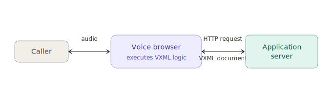

# VoiceXML

---

## 1. What is VoiceXML?

VoiceXML (VXML) is a W3C standard XML-based markup language for building interactive voice applications - phone menus, automated agents, and speech-driven workflows. It is the language that powers IVR (Interactive Voice Response) systems in contact centers.

> **Web Browser Analogy**
> VoiceXML is to voice applications what HTML is to web pages. A web browser fetches HTML and renders it visually. A voice browser fetches VXML and renders it acoustically - speaking prompts, collecting input, and navigating between dialogs.

**Why it matters for CCaaS:** VoiceXML is the entry point. Before a caller ever reaches an agent - human or AI - they pass through a VoiceXML-driven IVR. Understanding VXML explains why call transcripts have the structure they do, how routing decisions are made before handoff, and what the pre-agent call flow looks like before data reaches any analytics layer.

**Versions:** VoiceXML 2.0 (2004) is the base spec. VoiceXML 2.1 (2007) is the widely deployed production version - it adds `<data>`, `<foreach>`, and consultation transfer. All major platforms (Cisco CVP, Genesys, Avaya) implement 2.1. VoiceXML 3.0 exists as a draft but is not in production use.

---

## 2. The Runtime Model

### 2.1 The Voice Browser

The voice browser (also called a VoiceXML interpreter) is the runtime engine. It sits between the call media layer and your application logic - receiving audio in, producing audio out, and executing VXML documents. Its job:

- Fetch VoiceXML documents from a server (like a web browser fetching HTML)
- Play audio prompts via TTS (text-to-speech) or pre-recorded audio
- Collect caller input via speech recognition or DTMF keypad
- Execute document logic and navigate to the next document or dialog



### 2.2 Sessions and Documents

A **session** begins when a caller interacts with a VoiceXML application and ends when they hang up or the application terminates. A session spans multiple documents. Each **document** handles one logical step in the conversation.

> **Document Flow Pattern**



The voice browser is a thin client; your server is where business logic lives. One VXML document handles one collection unit - which may involve multiple prompts and reprompts - and submits when complete.

### 2.3 Dialogs

A document is made up of one or more dialogs, the term for a named unit of conversation. There are two types:

| Dialog Type | Purpose |
|---|---|
| `<form>` | The main workhorse. Collects one or more inputs using the Form Interpretation Algorithm (FIA). Most of your VXML will be forms. |
| `<menu>` | A convenience shorthand for offering a list of choices and branching based on selection. Translates to a form internally. |

---

## 3. Forms, Fields, and the FIA

### 3.1 Document Structure

Every VoiceXML document follows this skeleton:

```xml
<?xml version="1.0" encoding="UTF-8"?>
<vxml version="2.1" xmlns="http://www.w3.org/2001/vxml">

  <!-- dialogs go here -->

</vxml>
```

### 3.2 The `<form>` Element

Forms are the core of VXML. A form contains field items that collect input, block items that execute logic, and filled handlers that run when fields are satisfied.

```xml
<form id="collect_account">

  <field name="account_number">
    <prompt>Please enter your account number followed by the pound sign.</prompt>
    <grammar type="application/srgs+xml" src="digits.grxml"/>
  </field>

  <block>
    <submit next="https://api.example.com/lookup"
            method="post"
            namelist="account_number"/>
  </block>

</form>
```

### 3.3 The Form Interpretation Algorithm (FIA)

Forms do not execute top-to-bottom like a script. They use the FIA - a loop that drives the conversation:




> **Why the FIA Matters**
> The FIA is what makes VXML forms resilient. Each field independently manages its own retry loop. You define the prompts and error handling once per field, and the FIA orchestrates the conversation.

### 3.4 Fields and Grammars

Each `<field>` names a variable and defines what input is valid via a `<grammar>`. Grammars follow the SRGS (Speech Recognition Grammar Specification) standard and come in two forms:

- **DTMF grammars** - match keypad input (digits, *, #)
- **Speech grammars** - match spoken utterances against a defined vocabulary

---

## 4. Core Element Reference

| Element | Description |
|---|---|
| `<vxml>` | Root element of every document. Set `version="2.1"` and `xmlns`. |
| `<form>` | A dialog that collects input and runs logic via the FIA. |
| `<menu>` | Shorthand for a choice-based form. Transitions based on user selection. |
| `<field>` | Declares a variable to collect from the caller, with an associated grammar. |
| `<block>` | A form item that executes immediately without collecting input. |
| `<filled>` | Runs when named fields (or all fields) have been satisfied. |
| `<prompt>` | Text to synthesize (TTS) or audio file to play. |
| `<grammar>` | Defines valid input - DTMF or speech. References SRGS grammar files. |
| `<goto>` | Navigates to another dialog (`#anchor`) or document (URL). No data sent. |
| `<submit>` | POSTs collected variables to a server URL. Server returns next VXML document. |
| `<transfer>` | Routes the call to a SIP URI or phone number. `blind` fires and forgets; `bridge` waits for result and returns control. |
| `<subdialog>` | Calls an external VXML document like a function. Returns a result object. |
| `<var>` | Declares a variable in the current scope. |
| `<value>` | Outputs the value of an ECMAScript expression as speech. |
| `<if>` / `<elseif>` / `<else>` | Conditional logic. `cond` attribute takes an ECMAScript boolean expression. |
| `<catch>` | Handles events (`noinput`, `nomatch`, `error`, etc.) at field, form, or document scope. |
| `<reprompt>` | Replays the last prompt. Used inside `<catch>` blocks. |
| `<exit>` | Ends the VXML session; platform typically hangs up. Use when conversation completes normally. |


---

## 5. Events and Error Handling

### 5.1 Key Events

| Event | When Thrown |
|---|---|
| `noinput` | Caller said nothing within the configured timeout. |
| `nomatch` | Caller input did not match the active grammar. |
| `error` | Application or platform-level error. |
| `error.badfetch` | Server URL could not be fetched. |
| `telephone.disconnect` | Caller hung up. |
| `telephone.transfer.failed` | Transfer could not complete. |

### 5.2 Catching Events

Use `<catch>` at field, form, or document scope. The `count` attribute escalates on repeated occurrences. You can catch multiple events in one handler using a space-separated list. Put count-specific handlers before catch-alls - the platform evaluates in document order and a no-count handler will shadow anything below it:

```xml
<!-- Combined handler for both events -->
<catch event="noinput nomatch">
  <prompt>I didn't get that. Please try again.</prompt>
  <reprompt/>
</catch>

<!-- Escalate on third noinput specifically -->
<catch event="noinput" count="3">
  <prompt>Let me connect you with an agent.</prompt>
  <transfer dest="sip:queue@pbx.example.com" type="blind"/>
</catch>
```

### 5.3 Event Scope

Events bubble up through scope levels. A `<catch>` in a `<field>` handles that field only. A `<catch>` in a `<form>` handles all fields in that form. A `<catch>` in `<vxml>` handles the entire document.


---

## 6. Transitions

| Element | Behavior |
|---|---|
| `<goto next="#id">` | Navigate within the same document. No data sent. |
| `<goto next="file.vxml">` | Fetch a new document. No data sent. |
| `<submit next="url" method="post" namelist="vars">` | POST named field variables to server. Server returns next VXML. Primary backend integration point. |
| `<subdialog src="url">` | Call external VXML as a reusable component. Returns a result via `<return>`. |
| `<transfer dest="sip:..." type="blind">` | Route the call and terminate the VXML session immediately. No result. |
| `<transfer dest="sip:..." type="bridge">` | Route the call and wait. Returns control with a result: `connected`, `noanswer`, `busy`, etc. |

**Submit** is the primary way VXML talks to your backend. The voice browser is stateless between submits - identical to HTML form submission. Whatever fields are in `namelist` get POSTed; anything omitted is silently dropped.

---

## 7. VoiceXML in Modern CCaaS

### 7.1 Traditional IVR Role

In a conventional contact center, VoiceXML handles the entire pre-agent interaction: greeting, intent collection, account verification, and routing. Every possible caller path is modeled in VXML documents and grammar files. This is a finite state machine - powerful but rigid.

### 7.2 AI-Enhanced Patterns

**NLU Replacing Grammar Files**
Instead of SRGS grammars with fixed vocabulary, the grammar references an NLU endpoint. The platform sends the caller's utterance to a natural language model that returns a structured **intent** and **slots**. Intent is the classified action - `book_flight`, `report_outage`, `check_balance`. Slots are the named parameters extracted alongside it - `origin = Chicago`, `date = April 20`, `account_type = checking`. Think of it as method name plus arguments. VXML still orchestrates the flow; NLU replaces the rigid grammar file at the recognition layer.

**Virtual Agent as a Call Flow Node**
VXML handles initial routing and simple structured collection, then issues a `<transfer>` to a conversational AI platform (Google CCAI, Amazon Lex, Nuance Mix, etc.). At that point VXML is suspended or done - the virtual agent runs its own conversation in its own runtime and is not operating through VXML. It is a separate system that takes over at the media layer via SIP transfer. If the virtual agent resolves the issue, the call ends there. If it escalates to a human, the call goes to the agent queue - VXML does not resume. The only case VXML picks back up is if the virtual agent explicitly hands control back to a VXML application (e.g., a post-call survey), which is a deliberate architectural choice, not the default.

**Dynamic VXML Generation**
The most aggressive pattern: your backend generates VXML documents on the fly using an LLM. The voice browser sees standard VXML and has no knowledge that the document was generated rather than templated. This enables open-ended, context-aware voice interactions while preserving compatibility with existing VXML interpreters.

---

## 8. Key Concepts Summary

| Term | Definition |
|---|---|
| Voice browser | The VXML runtime engine. Fetches documents, plays audio, collects input. Equivalent to a web browser. |
| Session | The full duration of one caller's interaction. Spans multiple documents. |
| Document | One VXML file. Handles one logical step. Server returns a new document after each submit. |
| Dialog | A `<form>` or `<menu>` within a document. The unit of conversation state. |
| FIA | Form Interpretation Algorithm. The loop that drives field collection - prompt, listen, validate, repeat. |
| Field | A named variable to collect from the caller, paired with a grammar defining valid input. |
| Grammar | SRGS-format specification of what input counts as valid (speech or DTMF). |
| Event | A signal thrown by the platform - noinput, nomatch, error, disconnect. Caught with `<catch>`. |
| Submit | Sends collected data to your backend server via HTTP. Server returns next document. |
| Transfer (blind) | Routes the call and terminates the VXML session. No result returned. |
| Transfer (bridge) | Routes the call and waits. Returns control with a result when the transfer ends. |
| Subdialog | Calls an external VXML document as a reusable component. Returns a result. |
| Intent | In NLU-enhanced IVRs, the classified action extracted from a caller's utterance (e.g., `check_balance`). |
| Slots | Named parameters extracted alongside an intent. Intent is the what; slots are the structured data. Analogous to method name vs. arguments. |

---

*ClearCall Unit - Revature CCaaS Foundations*
