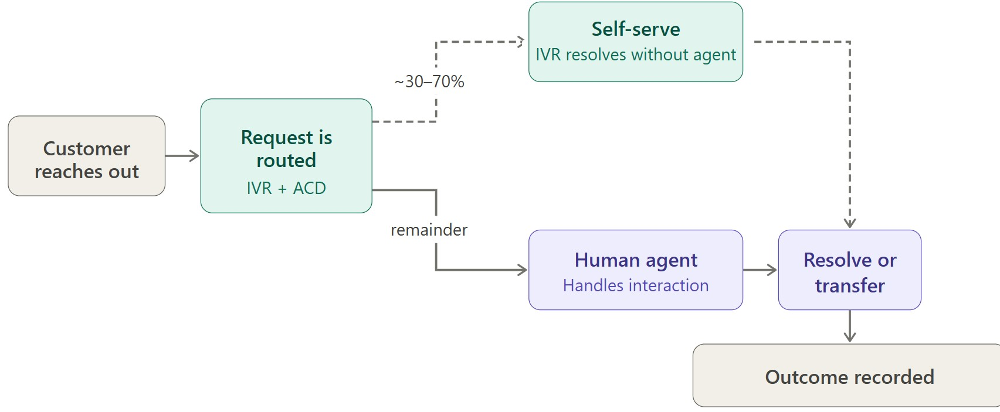
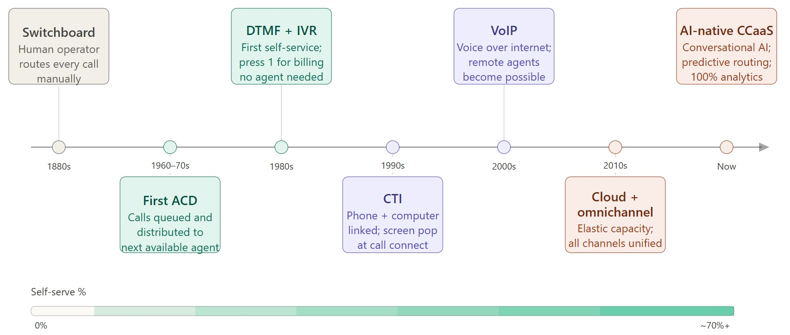

# CCaaS Foundations

1. [What is a Contact Center?](#part-1-what-is-a-contact-center) 
1. [A Brief History](#part-2-a-brief-history) 
1. [The People and Metrics](#part-3-the-people-and-metrics)
1. [CRM - Customer Relationship Management](#part-4-crm---customer-relationship-management)
1. [How CRM and the Contact Center Work Together](#part-5-how-crm-and-the-contact-center-work-together)
1. [On-Premise Contact Centers](#part-6-on---premise-contact-centers)
1. [CCaaS - Contact Center as a Service](#part-7-ccaas---contact-center-as-a-service)
1. [ACD - Automatic Call Distributor](#part-8-acd---automatic-call-distributor)
1. [IVR - Interactive Voice Response](#part-9-ivr---interactive-voice-response)
1. [UCaaS vs. CCaaS](#part-10-ucaas-vs-ccaas)

---

## Part 1: What is a Contact Center

Before we talk about any technology, we need to understand what a contact center actually is and why it exists. Every tool and platform you'll learn this week is just a solution to a problem that contact centers faced at a specific point in history.

### What Is a Contact Center?

A contact center is an operation where a company centralizes all of its customer communication. The reason companies centralize this - rather than just giving every customer a direct employee number - comes down to three things:

- **Volume** - A company with millions of customers can't have every employee reachable directly. Contact centers act as a funnel.
- **Specialization** - Not every employee knows how to handle a billing dispute, a technical outage, or a fraud claim. Contact centers route to the right person.
- **Measurement** - When communication is centralized, everything becomes measurable. How long did customers wait? How many gave up? How often was the issue resolved on the first contact? This data drives the entire operation.

> **Call Center vs. Contact Center** - You'll hear these terms used interchangeably, but they mean different things. A *call center* handles phone calls only. A *contact center* handles all the ways a customer might reach a company - phone, email, chat, SMS, social media, messaging apps. The *C* in CCaaS stands for **Contact**, not Call, and that's load-bearing. The entire value proposition of modern platforms is handling all of these channels in one unified system.

### The Basic Flow of a Customer Interaction

Before any technology, understand what actually happens when a customer contacts a company:

Every piece of CCaaS technology you'll learn this week is automating or optimizing one of those five steps. Keep coming back to this list when something feels abstract.

---

## Part 2: A Brief History

### Era 1: The Switchboard (1880s–1960s)

A customer picks up a phone and reaches a **human operator** whose entire job is to manually plug cables into a switchboard to route the call to the right person. There is no self-service. There is no queue - if the operator is busy, you try again later.

The operator *is* the routing logic. It doesn't scale.

---

### Era 2: Direct Dial and the First Queues (1960s–1970s)

Automatic switching means calls can reach a department directly without an operator. But now a new problem emerges - what happens when all the agents in that department are busy? The phone just rings forever or the caller gets a busy signal.

The first **Automatic Call Distributors (ACD)** appear in this era, initially in airlines. The ACD does one thing: it holds calls in a queue and distributes them to the next available agent in order. "Your call is important to us, please hold" becomes physically possible for the first time.

Self-service still doesn't exist. A human handles every interaction.

---

### Era 3: Touch-Tone and IVR (1980s)

Touch-tone phones use **DTMF - Dual Tone Multi Frequency**. A caller can press a key on their phone and the receiving system detects that exact pair and knows which key was pressed. This mechanism unlocks the first real self-service: **Interactive Voice Response (IVR)**. A recorded voice can say "press 1 for billing, press 2 for technical support" and the system genuinely responds.

One important clarification: **IVR in this era is not truly two-way voice.** Voice travels *to* the caller as pre-recorded audio. The caller's "response" is not voice - it's DTMF tones from key presses. 

Banks in the 1980s began deflecting enormous call volumes to IVR for balance inquiries alone. Self-service becomes real, but it's rigid - if your need doesn't fit the menu tree, you're stuck. The technology stack at this point is multiple separate physical boxes: phone line, ACD server, IVR server, agent.

---

### Era 4: CTI and the Screen Pop (1990s)

**Computer Telephony Integration (CTI)** is the moment the phone system and the computer system start talking to each other. Before CTI, an agent answered knowing nothing about the caller. With CTI, when a call arrives, the agent's screen automatically displays the customer's record - name, account history, last interaction - before they even say hello. This is called a **screen pop**.

Skills-based routing also matures in this era. Instead of routing to the next available agent, the ACD routes to the agent with the right *skills* for this particular call - language, product expertise, customer tier authorization.

The contact center also begins expanding beyond voice. Email queues start appearing, though they're typically handled by completely separate teams using completely separate tools. Multiple channels exist but they're siloed - there is no unified view of a customer across channels yet.

---

### Era 5: VoIP and the Internet Contact Center (2000s)

Voice over IP means calls travel over the internet rather than dedicated phone lines. The implications are significant:

- Agents no longer need to be physically wired into a private branch exchange (PBX) switch
- Adding capacity becomes a software problem rather than a hardware procurement
- Call recording and monitoring become software features
- Remote agents become technically feasible for the first time

Web chat emerges as a real contact center channel. The term "contact center" begins replacing "call center" because the channel mix is genuinely changing. Basic speech recognition starts appearing in IVR - callers can say "billing" instead of pressing 1 - but recognition is fragile enough that customers quickly learn to press 0 repeatedly to reach a human.

---

### Era 6: Cloud and Omnichannel (2010s)

Contact center infrastructure moves to the cloud. Instead of owning hardware, companies subscribe to platforms. This changes the economics completely:

- Scale up for the holiday season, scale back down in January - pay only for what you use
- No hardware procurement, no maintenance windows, no specialized telecom engineering staff
- Agents log in from anywhere via a browser - the contact center is a capability, not a building

Channels continue to proliferate - email, chat, SMS, social media, messaging apps - and the pressure to unify them grows. **Omnichannel routing** means a single platform handles all of these, and a customer's full history across every channel is visible in one place.

A critical moment in this era: when COVID-19 forced offices to close overnight, companies running cloud-based contact center platforms had agents working from home the next day. Companies running on-premise hardware faced an existential operational problem. That single event accelerated cloud adoption by years.

---

### Era 7: AI-Native CCaaS (Now)

The shift is now exceeding just automation - intelligence can be layered across every part of the stack:

- **Conversational AI** replaces rigid menu trees. Callers speak naturally and the system understands intent. Containment rates - calls fully resolved without an agent - rise from 20–30% with DTMF IVR to 60–70%+ with well-implemented conversational AI.
- **Real-time agent assist** listens to live calls and pushes relevant knowledge articles, suggested responses, and compliance warnings to the agent's screen as the conversation happens.
- **Post-call analytics at scale** - instead of quality analysts manually sampling 2–3% of calls, AI analyzes 100% of transcripts for sentiment, compliance, topic classification, and outcome prediction.
- **Predictive routing** uses machine learning to match callers not just to the agent with the right skill, but to the specific agent whose interaction style historically produces the best outcomes for this type of customer.

---

## Part 3: The People and Metrics

Understanding who works in a contact center matters because the platforms you'll build on exist to serve these people.

### Roles

**Agents** handle the frontline interactions. Their performance is measured primarily on two things: how long each interaction takes and whether the customer's issue was resolved without them having to contact the company again.

**Supervisors** monitor agent queues in real time. They can listen to calls silently (barge), or speak to an agent without the customer hearing (whisper). They make live decisions about staffing when volume spikes unexpectedly.

**Workforce Management (WFM) analysts** forecast interaction volume and schedule agents accordingly. Understaffing means customers wait. Overstaffing burns budget. This is sophisticated data work - forecasting models account for time of day, day of week, seasonality, marketing campaigns, and external events.

**Quality Analysts** listen to recorded interactions and score them against rubrics: Did the agent follow compliance requirements? Were they empathetic? Did they offer the correct resolution? This manual process is exactly what AI-native platforms are beginning to automate at scale.

### Key Metrics

| Metric | What It Measures |
|---|---|
| **AHT** (Average Handle Time) | Total time per interaction including post-call wrap-up |
| **FCR** (First Call Resolution) | Percentage resolved without the customer contacting again |
| **CSAT** (Customer Satisfaction) | Post-interaction survey score |
| **Abandon Rate** | Percentage of customers who give up before reaching anyone |
| **Service Level** | Percentage of contacts answered within a target time (commonly 80% within 20 seconds) |
| **Containment Rate** | Percentage of interactions fully handled without a human agent |
| **Occupancy** | Percentage of time agents are actively handling interactions vs. idle |

---

## Part 4: CRM - Customer Relationship Management

### What Is It?

A CRM is a database with a purpose-built interface organized around one idea: **every interaction a company has ever had with a customer should be recorded in one place, attached to that customer's record, and accessible to anyone who needs it.**

Before CRM, customer information lived everywhere and nowhere. A sales rep's notes were in a personal spreadsheet. A support agent had no idea what the sales team had promised a customer last month. If a customer bought three products over five years, nobody had a unified view of that relationship.

CRM solves this by being the **single source of truth for everything customer-related.** A customer record typically contains contact information, account details, every logged email and call, purchase history, open support tickets, contract value, and renewal dates.

### Who Uses It and How

**Sales** uses CRM to manage pipeline. Every prospect is a record. Every deal has a stage - first contact, demo scheduled, proposal sent, closed. Leadership can see where every deal in the company stands at any moment without asking anyone.

**Marketing** uses CRM to segment customers and track campaign results. Send a campaign to everyone who purchased a specific product in the last year - that list comes from the CRM. Track whether those customers upgraded - that outcome goes back into the CRM.

**Support and Service** use CRM during customer interactions. When an agent already knows who you are before you explain, that's CRM data surfaced at the right moment.

Salesforce is so dominant in this space that in enterprise environments people sometimes say "our Salesforce" to mean their CRM generically. Other significant players include HubSpot, Microsoft Dynamics, and Zoho.

---

## Part 5: How CRM and the Contact Center Work Together

### The Core Distinction

> **The CRM is the memory. The contact center is the conversation.**

The CRM stores everything that has ever happened with a customer. The contact center handles what is happening right now. They solve completely different problems and neither replaces the other.

When a customer contacts a company:

- The **contact center platform** answers the interaction, manages the queue, routes to the right agent, and records the exchange
- The **CRM** tells the agent who this person is, what they've purchased, what problems they've had, and what was promised to them previously

Without CRM, the agent is blind - meeting the customer for the first time on every single interaction regardless of years of history. Without the contact center platform, the CRM is a filing cabinet nobody can efficiently access in real time during a live interaction.

### The Integration Pattern

CRM and contact center platforms are almost always separate systems from separate vendors that communicate via API. The integration typically works like this:

When an interaction arrives, the contact center platform sends a request to the CRM API with the customer's phone number or email address. The CRM returns the customer record. That data gets surfaced to the agent in the seconds while the interaction is connecting - this is the screen pop discussed earlier.

When the interaction ends, the contact center sends outcome data back to the CRM: duration, disposition (resolved, escalated, callback needed), and any notes the agent logged. The CRM record updates automatically.

From a developer perspective: **CRM and the contact center platform are two systems continuously exchanging data at key moments in the customer interaction lifecycle.** Building and maintaining that integration is a common engagement for developers working in this space.

---

## Part 6: On-Premise Contact Centers

To understand what CCaaS is, you need to understand what it replaced.

Running a contact center traditionally meant purchasing and owning significant physical infrastructure:

- A **PBX (Private Branch Exchange)** - the physical switch managing all internal and external calls
- An **ACD server** - separate hardware running routing logic
- An **IVR server** - separate hardware running self-service menus
- **Recording appliances** - physical servers storing interaction audio
- **CTI middleware** - software integrating the phone system with computers
- **WFM software** - typically yet another dedicated server

All of this lived in a company's data center. The upfront cost for a large operation ran into the millions before a single customer interaction was handled. Scaling up - say, adding agents for the holiday season - meant procuring hardware weeks or months in advance. Updates required maintenance windows and carried real risk of breaking something. And critically, **agents had to be physically present in the building**, connected to the infrastructure.

The teams who maintained this infrastructure were specialized telecom engineers who understood PBX configuration, telephony protocols, and circuit provisioning - a narrow and expensive skill set. Integrating this hardware with external systems like CRM was a real challenge: the integration was always ultimately implemented in software, but before you could write a line of that software you had to negotiate proprietary protocols, vendor-specific SDKs, and non-standard interfaces that the telephony hardware expected. Modern web APIs - REST, webhooks, JSON, OAuth - were not the norm in this world.

---

## Part 7: CCaaS - Contact Center as a Service

### What Changes

CCaaS moves every component of the contact center infrastructure into the cloud and delivers it as a subscription service. The *capabilities* don't change - you still need routing, IVR, recording, workforce management, CRM integration. What changes completely is how those capabilities are delivered and what that means operationally.

**Capital expenditure becomes operating expense.** Instead of millions upfront, you pay per agent per month. A company can start with 20 seats and grow to 2,000 without a hardware conversation.

**Capacity is elastic.** Need 300 additional agents for a product launch? Provision them in the platform that afternoon. Scale back when the surge passes. You pay for what you use.

**Geography disappears.** An agent in Chicago, Manila, and Dublin all log into the same platform via browser. From the routing engine's perspective they're identical. The contact center becomes a capability agents access, not a building they report to.

**Updates are continuous.** The vendor ships improvements constantly. You're always on the current version without upgrade projects or migration risk.

**Integration becomes standard software work.** CCaaS platforms are API-first by design. Connecting them to CRM, workforce management, analytics, and AI layers means working with REST APIs, webhooks, and OAuth - the same interfaces your associates already know. There's no proprietary telephony protocol standing between you and the integration you need to build.

**The required skill set shifts.** On-premise contact centers needed specialized telecom engineers. CCaaS platforms are configured through web interfaces and extended through APIs. The people building on them look like software developers - which is a significant part of why this space creates work for people with Java and JavaScript backgrounds.

### Major Platforms

The leading CCaaS vendors you'll encounter in enterprise environments include Genesys Cloud, NICE CXone, Five9, AWS Connect, and Google Customer Engagement Suite (CES). Each takes a somewhat different approach to the AI and integration layer, which is where most differentiation exists today.

---

## Part 8: ACD - Automatic Call Distributor

The ACD is the routing engine - the component that decides what happens to an incoming interaction.

### What It Does

At its most primitive, an ACD is a queue with round-robin distribution: the next interaction goes to whichever agent has been idle the longest. Simple, but immediately inadequate. What if the interaction is in Spanish? What if it requires a licensed financial advisor? What if the customer is a high-value account?

**Skills-based routing** is the evolution: agents are tagged with skills - languages, product knowledge, certifications, customer tier authorization - and the ACD matches interaction requirements to agent skills. The combinations become complex quickly when hundreds of agents carry dozens of skill tags and thousands of interactions are in flight simultaneously.

### ACD Input

The ACD doesn't operate in isolation. By the time it makes a routing decision, it has typically received information from multiple sources:

- **From the IVR** - the customer already indicated why they're contacting. That intent travels to the ACD as a tag on the interaction.
- **From the number or address contacted** - different phone numbers and email addresses serve different purposes. The destination alone signals something before the customer says a word.
- **From ANI (Automatic Number Identification)** - caller ID, but what the system does with it matters. The ACD looks up the number in the CRM, finds a Platinum tier account, and elevates queue priority before the customer has spoken.
- **From IVR authentication** - the IVR may have already verified the caller's identity and retrieved their account. That data travels with the interaction into the routing decision.

By the time the ACD routes an interaction, it often already knows: who is contacting, why they're contacting, how valuable they are to the business, and what kind of agent profile they need.

---

## Part 9: IVR - Interactive Voice Response

The ACD and IVR are deeply intertwined and often confused. The simplest boundary:

- **IVR** interacts with the customer to collect information and potentially resolve the interaction entirely
- **ACD** takes that information and decides where the interaction goes if a human is needed

### What the IVR Is Actually Doing

**Containment** - Resolving the interaction without any agent. Balance inquiries, appointment confirmations, order status, bill payment. Every interaction the IVR fully handles never enters the agent queue. Containment rate directly determines staffing costs, which is why it's one of the most-watched metrics in the operation.

**Intent collection** - When the IVR can't contain the interaction, it gathers as much information as possible before handing to an agent. Not just "they pressed 2 for billing" but potentially account number, nature of issue, what they've already attempted. All of this travels with the interaction.

**Authentication** - Verifying the caller's identity before they reach an agent. This saves significant handle time because the agent doesn't need to re-verify. The customer arrives at the agent already authenticated.

**Queue management** - In modern systems the IVR actively manages the customer's experience while they wait: estimated wait times, callback options, position updates.

### The Handoff

When the IVR transfers to the ACD, it passes a data packet with everything it collected - call reason, authentication status, customer tier, any account data it retrieved. The ACD routes accordingly, and the CTI layer delivers all of it to the agent's screen at the moment the interaction connects.

From the agent's perspective: a call arrives, they answer, and they already know who it is, why they're calling, and that authentication is complete. The opening "Hi Sarah, I see you're calling about your recent invoice" is the payoff of the entire system working in concert.

---

## Part 10: UCaaS vs. CCaaS

This distinction matters because the two categories sound similar, serve overlapping populations, and vendors deliberately blur the line. Be precise.

### UCaaS - Unified Communications as a Service

UCaaS is about **internal communication** - how employees inside a company communicate with each other.

It typically bundles: voice calling between employees, video conferencing, instant messaging, file sharing, and presence indicators (the availability status on a colleague's profile). The "unified" part means all of these modes exist in one platform rather than separate tools.

The canonical example is **Microsoft Teams**. Zoom, Google Workspace, and Cisco Webex are UCaaS platforms. The customer is irrelevant to UCaaS - it is entirely inward-facing.

### CCaaS - Contact Center as a Service

CCaaS is about **external communication** - how agents interact with customers. It delivers everything discussed in this document: routing, IVR, recording, workforce management, CRM integration, analytics.

### The Clean Distinction

| | UCaaS | CCaaS |
|---|---|---|
| **Who communicates** | Employees with employees | Agents with customers |
| **Direction** | Internal | External |
| **Primary concern** | Collaboration efficiency | Customer experience |
| **Core capabilities** | Presence, meetings, messaging | Routing, IVR, queue management |
| **Example platforms** | Microsoft Teams, Zoom | AWS Connect, Genesys Cloud |

### Where It Gets Complicated

Agents are also employees. An agent handling a customer call may need to immediately pull a billing specialist into that call, consult a supervisor, or join a team briefing about a product outage. That's internal communication - UCaaS territory - happening in the middle of a customer interaction - CCaaS territory.

Modern platforms have responded by pushing toward integration or even convergence. Microsoft has extended Teams toward contact center capabilities. Cisco has always operated in both spaces. Zoom launched a contact center product. The vendor pitch is always "why manage two platforms?"

The honest answer in most enterprises is: they already have both, from different vendors, chosen by different parts of the organization at different times, and integration between them is the ongoing work. When evaluating any client environment, assume separate systems until you have evidence otherwise - especially in large enterprise contexts.