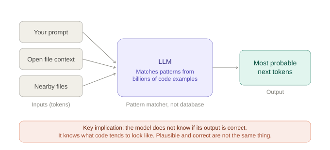
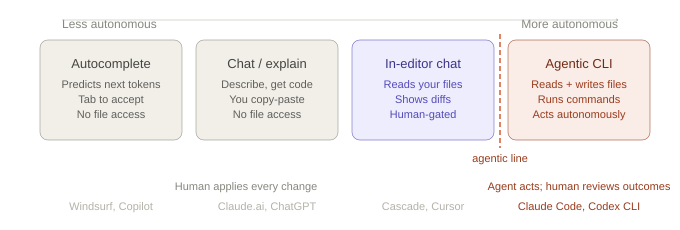
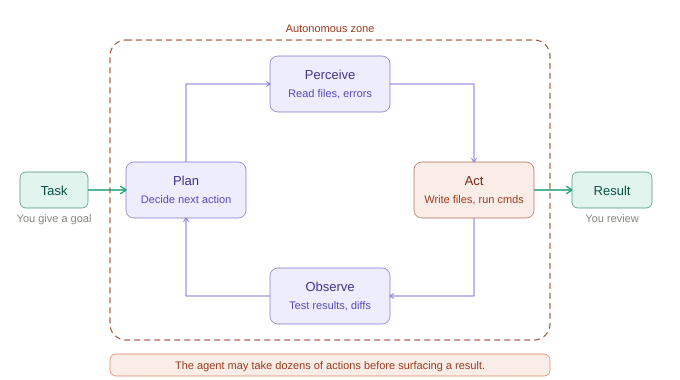

# Code Generation with GenAI

## What AI assistance actually is

Before touching a tool, you need a working mental model of what's happening. Not deeply - just enough to reason about what a tool can and can't do, and why it sometimes confidently produces wrong output.

### Large language models

Every AI coding tool you'll encounter - Windsurf, GitHub Copilot, Claude Code, ChatGPT - is built on a **large language model (LLM)**. An LLM is trained on a massive corpus of text (including enormous quantities of code) and learns to predict what comes next in a sequence of tokens.

When you type a function signature, the model is not looking up the answer in a database. It is generating the most statistically probable continuation based on patterns it saw during training.




> **If you are generating code with AI, you must:**
> - **Read it** - understand what it's doing before you accept it
> - **Run it** - never assume it works because it looks right
> - **Test it** - cover the cases the model may not have considered
> - **Own it** - you are accountable for what you commit, not the tool that suggested it
>
> The professional skill has shifted from writing syntax to reviewing, testing, and catching hallucinations.

| What LLMs do well | What they cannot do |
|---|---|
| Pattern completion - finishing functions, adding imports, completing loops | Verify correctness - they have no ground truth |
| Translation - Java to Python, SQL to JPQL, imperative to functional | Know your runtime state - they see text, not a running system |
| Explanation - what does this code do, what does this error mean | Know library changes after the LLM was trained - its knowledge is frozen |
| Boilerplate generation - DTOs, test stubs, config files | Understand your business domain without you explaining it |

---

## The four levels of AI assistance

Not all AI coding tools work the same way. The key variable is **autonomy** - how much the tool acts on your behalf versus waits for you to act. This spectrum matters because as autonomy increases, so does both potential impact and potential for unintended consequences.



### Level 1 - Autocomplete

The model watches what you type and predicts what comes next, inline in the editor. You accept with Tab. Nothing happens until you decide.

- Works one suggestion at a time
- No file access beyond the currently open file (and nearby files for context)
- Zero autonomy - every token is gated by you
- **Examples:** Windsurf inline, GitHub Copilot autocomplete, Tabnine

### Level 2 - Conversational AI

You describe what you want in a chat window and the model returns code or explanation. You copy the output and apply it yourself. The tool has no access to your project files.

- You describe the problem; it returns a suggestion
- No access to your actual files or environment
- You are the bridge between the suggestion and the codebase
- **Examples:** Claude.ai, ChatGPT, Gemini

### Level 3 - In-Editor Chat

The tool reads your project files and proposes multi-file changes as a diff. You review and accept or reject before anything is written to disk.

- Has read access to your full project
- Proposes changes shown as diffs for your review
- Still human-gated: nothing changes until you accept
- **Examples:** Windsurf Cascade, Cursor Composer, GitHub Copilot Edits

> **Where you'll spend most of your time**  
> Levels 1–3 are where daily AI-assisted development happens. The feedback loop is fast and you remain in control of every change that actually gets written to disk.

---

## 3. Agentic AI

### What "agentic" actually means

The word is overused in marketing. "Agentic" has become shorthand for "does more stuff," which obscures the real distinction.

The precise definition: **a system is agentic when it uses tools to take actions in the world autonomously across multiple steps, without human approval at each step.**

The two required properties are:

1. **Tool use** - the system can read/write files, run shell commands, call APIs, execute code
2. **Autonomous looping** - it decides what to do next based on what it observed, without waiting for you

An in-editor chat (Level 3) that shows you diffs is not fully agentic because it gates every write action. A CLI agent that reads ten files, writes three new ones, runs your test suite, observes the failures, edits the implementation, and re-runs tests - all without asking - is agentic.




### The agentic loop in plain terms

This loop may iterate a dozen times before surfacing a result. You see the outcome. You do not see each step as it happens.

### Why the line matters

| In-editor Chat (Level 3) | Agentic CLI (Level 4) |
|---|---|
| Reads your files | Reads **and writes** your files |
| Proposes a diff | Applies changes directly |
| Waits for your approval | Iterates autonomously |
| You review each action | You review outcomes |
| Limited blast radius | Can modify many files before you see anything |

An agentic tool running in your project can modify code across dozens of files, run commands with real side effects, and accumulate changes before you ever see a summary. Passing tests are not a substitute for reading the diff. The agent may have taken a path you wouldn't have chosen, introduced technical debt, or made changes you didn't intend.

> Before using an agentic CLI tool on a real project: commit your current state to git first. Every time. The agent's undo button is `git checkout`.

### Popular Agentic Tools

Windsurf (Levels 1 and 3) is your primary tool. But you will encounter these professionally.

| Tool | What it is |
|---|---|
| **Claude Code** | Anthropic's terminal agent. Reads your codebase, executes shell commands, iterates autonomously. Billed by API token usage (~$10–30/month for moderate use). |
| **Codex CLI** | OpenAI's terminal agent. Uses GPT-4o or o3. Open source, configurable. |
| **Gemini CLI** | Google's terminal agent. Uses Gemini 2.5 Pro. Integrates with Google Cloud tooling. |

---

## 4. Windsurf

Windsurf is the default for this cohort. Free, no payment information required, covers Levels 1 and 3.

**Install options:**
- JetBrains Plugin - search "Windsurf" in the Extensions marketplace
- Standalone editor - download from codeium.com/windsurf

Create a free Codeium account and sign in.

#### Autocomplete

Works continuously as you type. Windsurf reads the open file and nearby files for context. Accept with Tab, ignore by continuing to type. This mode is **unlimited** on the free tier.

Watch for: suggestions that look right but reference methods or classes that don't exist in your version of a library. The model's training data has a cutoff - it may use a newer or older API than what you have.

#### Cascade (in-editor chat)

Cascade is the chat sidebar that can see your full project. Describe a task, and it proposes file edits shown as diffs. Level 3 - it waits for your approval before writing anything.

The free tier includes a monthly credit allocation for Cascade interactions. Autocomplete does not count against this limit. When you hit the limit, autocomplete still works.

**Cascade is most useful when you give it real project context:**

```
# Less useful
"Write a method to find a user by email"

# More useful  
"Add a findByEmail method to UserRepository. The User entity is in
com.clearcall.domain and uses Long as the ID type. Return Optional<User>."
```

There are many paid options available, many of which have free tiers. GitHub Copilot, Cursor, Claude Code, and Tabnine are all worth knowing exist.

---

## Responsible Use

Four principles apply every time you open a code generation tool - starting now.

### 1. Verify everything

AI-generated code is a first draft, not a solution. Run it. Test it. Read it. You are accountable for the code in your commit, not the tool that suggested it.

### 2. Know what you're sending

When you use an AI coding tool, your prompt and code context are sent to a remote server for processing. The questions worth asking are: where does it go, how long is it kept, and does it get used to train future models.

**Windsurf:** Your code context is sent to Codeium's servers. Per their current policy, it is not used to train their models. Cascade sends broader project context than autocomplete does.

**Some tools do train on your code.** Free tiers in particular often reserve the right to use conversations and code context to improve the model. Code you paste into a free chat interface may end up influencing future model outputs.

**The hard rule:** API keys, database credentials, passwords, and customer data never belong in a prompt - on any tool, on any tier. There is no safe way to paste a credential into a chat window and assume it stays private.

```
# Do not do this
"My connection string is jdbc:postgresql://prod-db:5432/users?password=abc123.
Why is my connection pool exhausting?"

# Do this instead
"Help me debug connection pool exhaustion in Spring Boot with HikariCP.

Here is the relevant config and stack trace: [sanitized]"
```

For proprietary code more broadly, check the data handling policy for your specific tier before using any tool with client code or internal systems. Free is not the same as enterprise in terms of data retention. When in doubt, describe the problem in general terms rather than pasting the code directly. Policies change, check them at the source.

### 3. You are still the engineer

AI tools shift where the work happens - from writing syntax to reviewing, debugging, and architectural thinking - but they do not remove accountability. If code you accepted causes a production incident, the post-mortem does not note "the AI wrote it." You reviewed it and committed it.

---

## How to prompt effectively

The quality of AI output is directly correlated with the quality of the input. This is a learnable skill.

### Give context, not just a request

| Less effective | More effective |
|---|---|
| `"Write a method to get a user by ID"` | `"Write a findById method for UserRepository using Spring Data JPA. Return Optional<User>. The User entity has an id field of type Long."` |
| `"Fix this error"` + stack trace | `"I'm getting a LazyInitializationException in ClearCallSessionService. The session entity has a @OneToMany to Transcript. Here's the stack trace and the relevant service method."` |
| `"Write tests for this class"` | `"Write JUnit 5 unit tests for CallRoutingService. Mock the AgentRepository and SkillMatcher dependencies. Cover: successful routing, no available agents, and routing by skill match."` |

### Common prompting patterns

**Constrain the output**  
`"Use only standard library. No external dependencies."` - prevents the model from suggesting libraries you don't have.

**Provide the signature, get the body**  
Give the model your method signature and let it fill in the implementation. This locks in your design choices.

**Ask for explanation before modification**  
`"Explain what this code does before you change it."` - catches misunderstandings early, before they become wrong code.

**Specify error handling explicitly**  
`"Throw a NotFoundException if the entity is not found."` - otherwise the model may return null, throw a generic exception, or silently swallow the error.

**Request tests alongside code**  
`"Write the implementation and a unit test for it."` - forces the model to reason about edge cases.

**State your constraints upfront**  
`"This must be compatible with Java 17 and Spring Boot 3.2."` - the model may otherwise use features or APIs that don't match your stack.

### Iterating on output

AI tools are most useful in a conversation, not a single shot. If the first response is close but wrong:

- Tell it specifically what's wrong: `"The method you wrote doesn't handle the case where userId is null. Fix that."`
- Don't restart from scratch unless the approach is fundamentally wrong
- If a response goes in a bad direction, a new conversation often works better than trying to correct a long context

---

## Trying Windsurf

**Autocomplete practice:** Open a Java file from your current project. Start typing a method and observe what Windsurf suggests. Practice the Tab/ignore rhythm. The goal is to develop a feel for when suggestions are trustworthy and when they need scrutiny.

**Cascade practice:** Open the Cascade panel. Give it a task with real project context:
- `"Explain what CallRoutingService does"`
- `"Add a health check endpoint to this Spring Boot application"`
- `"Write a unit test for the findBySkill method in AgentRepository"`

Review the proposed diff carefully before accepting. Make sure you read every line.

### Things to watch for

- **Hallucinated method names** - the model may call a method that doesn't exist in your version of a library
- **Outdated API usage** - training data has a cutoff; newer APIs may be used incorrectly
- **Missing imports** - generated code frequently assumes imports that aren't present
- **Wrong assumptions about your schema** - always verify generated queries against your actual data model
- **Overly complex solutions** - the model sometimes generates more abstraction than the problem requires; simpler is usually better


---

## More Use Cases

The same principles apply across everything you'll use AI for in development. Give it specific context, get specific output, verify before you use it.

### Writing tests

AI is genuinely strong here - tests are structured, follow predictable patterns, and don't require the model to understand your business logic deeply.

Watch out for tests that pass but don't assert the right thing, and missing edge cases specific to your domain.

**Signature-first:** Give it the method signature and what it should cover. Let it generate the structure, then verify the assertions.
> *"Write JUnit 5 unit tests for this method. Mock AgentRepository. Cover: successful match, no agents available, and skill not found. Here is the method signature: [paste signature]"*

**Test the gaps:** Paste an existing test class and ask what's missing.
> *"Here is my test class for CallRoutingService. What cases am I not testing? Suggest the missing test methods without writing them yet."*

### Documentation

AI saves the most tedious time here. Watch out for generic comments that describe syntax rather than intent - "this method returns a user" is not documentation.

**Intent-first:** Tell it what the method is *for*, not just what it does.
> *"Add Javadoc to this method. The intent is to route an incoming call to the best available agent based on skill match and current load. Emphasize what happens when no agent is available."*

**Audience-aware summary:** Useful when you need to explain something to a non-technical stakeholder.
> *"Summarize what ClearCallSessionService does in 2–3 sentences for a non-technical stakeholder. Avoid implementation details."*

### Code analysis

AI is a fast second set of eyes - useful for gut-checks before you hand something off. It will not replace static analysis tools or a real code review, and it tends to focus on style over logic bugs.

**Focused review:** Broad prompts get broad answers. Ask for something specific.
> *"Review this service method for potential null pointer exceptions and unhandled edge cases. Don't comment on style."*

**Explain before you change:** When inheriting unfamiliar code, ask it to explain before you touch anything.
> *"Explain what this class does and identify any parts that look fragile or worth understanding before modifying."*

### Optimization

Most useful for targeted improvements. The model optimizes for what it can see - it doesn't know where your app is actually slow.

Watch out for premature optimization suggestions and "optimizations" that subtly change behavior.

**Describe the constraint:** Tell it what you're trying to improve and why.
> *"This method is called on every incoming call event and queries the database inside a loop. Suggest how to restructure it to reduce database calls."*

**Readability over performance:** Optimization isn't only about speed.
> *"Refactor this method to be more readable. Keep the behavior identical. Prefer named variables and clear intent over brevity."*
