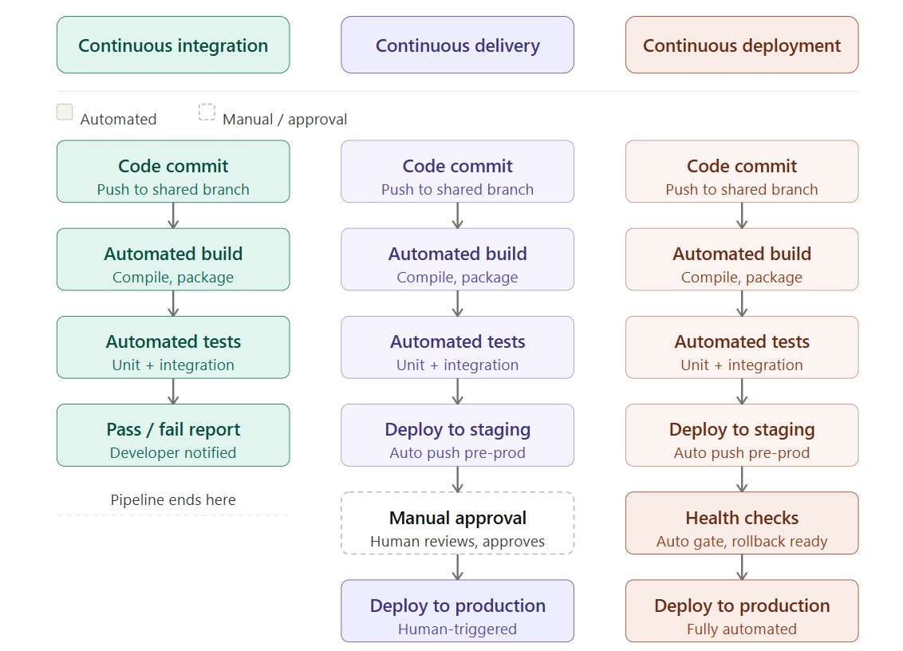

# DevOps

## DevOps Overview

DevOps is a cultural and technical movement that unifies software **development** (Dev) and **operations** (Ops) into a shared workflow, eliminating the old handoff model where developers threw code "over the wall" to an operations team. The teams responsible for building software are also responsible - or at least deeply involved - in deploying, monitoring, and maintaining it. The core goals are faster and more reliable delivery of software changes, shorter feedback loops between writing code and running it in production, automated and repeatable processes replacing manual toil, and shared ownership of system health across dev and ops.

RouteIQ and ClearCall aren't just coding exercises - they represent real systems with operational requirements. RouteIQ needs to be running and reachable to route calls. ClearCall needs to stay available to ingest and analyze conversation data. DevOps is the set of practices that addresses those requirements in a structured way: how the system gets deployed, how changes reach it safely, and how problems get caught before they affect anyone using it.

This same lens applies when building on top of platforms like **AWS Connect** or **Google CCAI Essentials (CES)**. These aren't just APIs you call - they're production contact center infrastructure. Custom routing logic, Lex bot integrations, Lambda functions, or agent assist features all have to be deployed somewhere, maintained over time, and recovered quickly when something breaks. The operational discipline of DevOps is what makes that possible at scale.

---

## Continuous Integration (CI)

Continuous Integration is the practice of merging developer code changes into a shared repository frequently - typically multiple times per day - with automated builds and tests triggered on every push. Without it, teams accumulate integration problems quietly. When everyone merges at the end of a sprint, you get "integration hell": conflicting changes, broken builds, and bugs that are hard to trace back to a single cause. CI catches those problems early, when they're small and cheap to fix.

The core idea is that CI creates a **controlled environment** where the application does everything it would normally do - install dependencies, build, run schema scripts, execute tests - but in a neutral, isolated space before the code reaches anywhere that matters. It's not doing anything exotic; it's just making sure the ordinary things work, automatically, on every change.

A typical CI pipeline detects a new commit or pull request, pulls the latest code, compiles and builds the project, runs unit and integration tests, and reports pass/fail back to the developer. Tools like GitHub Actions, Jenkins, GitLab CI, and CircleCI all follow this basic pattern. Here's what that automated work actually surfaces:

| CI automatically... | Which catches... |
|---|---|
| Runs unit tests | Broken Spring Boot endpoint logic |
| Installs Python dependencies | Missing or incompatible packages in the ETL pipeline |
| Executes CQL schema scripts | Syntax errors before they hit a shared Cassandra instance |
| Builds the Docker image | Missing files, bad configs, broken `Dockerfile` |
| Runs integration tests | A query that compiles but returns wrong data |

> **In practice:** For ClearCall, a CI pipeline would compile the Spring Boot data access service, validate the Python ETL pipeline, and spin up a Cassandra container via Docker to confirm the schema scripts execute cleanly - all on every push. For RouteIQ, a change that breaks call classification logic gets caught before it ever touches a shared environment. In a group project where multiple pairs are pushing code simultaneously, that safety net is what keeps one person's change from breaking everyone else's work.

---

## Continuous Deployment

Continuous Deployment extends CI by automatically deploying every build that passes all tests directly to a production (or production-like) environment - no human approval gate required. It's the most aggressive form of automation in the pipeline, and it requires high confidence in your test coverage, because a failing test is your only safety net.

Beyond running tests, a continuous deployment pipeline typically packages the application into a deployable artifact (often a Docker image), pushes it to a container registry, rolls it out to the target environment, runs post-deploy health checks, and triggers an automatic rollback if something looks wrong.

Imagine ClearCall operating as a live analytics platform alongside Amazon Connect or Google CES. Every time an engineer improves the transcript processing logic, updates the Cassandra schema for conversation storage, or tunes a routing rule in RouteIQ, continuous deployment would push that change to production automatically - no scheduling, no manual steps. The risk is real: a bad deploy can impact live call handling immediately. That's why teams operating at this level invest heavily in practices like feature flags (so new behavior can be toggled off without a redeployment) and canary releases (where a change goes to a small percentage of traffic first).

---

## Continuous Delivery

Continuous Delivery is frequently conflated with continuous deployment, but the distinction matters: in continuous delivery, every build is *ready* to deploy, but a human makes the final call on when to push to production. The pipeline does everything up to that point automatically. Think of it as "the deploy button always works - someone still pushes it."

This model is more common in environments where a release approval or change management process is required, which describes most enterprise software and certainly most CCaaS deployments.

For teams customizing AWS Connect or Google CES, continuous delivery is often the right fit. A broken contact flow update or a bad Lambda deployment means real customers hit broken IVR menus or get misrouted - feedback that arrives immediately and loudly. Continuous delivery keeps the pipeline fast and automated right up until someone with context looks at the staging environment and says "yes, ship it." Applied to RouteIQ, you could imagine a pipeline that deploys every successful build to a staging environment where the routing engine can be tested against realistic call data, with a one-click promotion to production when it looks good.

---

## DevOps and Agile

Agile and DevOps are complementary but distinct. Agile is primarily about *how teams plan and deliver work* - short sprints, iterative feedback, close collaboration with stakeholders. It addresses the question of how things get built. DevOps addresses what happens after the code is written: how it gets shipped, how it stays running, and how quickly problems get detected and fixed.

In practice, the two reinforce each other in important ways. Agile's sprint cadence maps naturally onto CI/CD release cycles. Both prioritize fast feedback - Agile from stakeholders reviewing working software, DevOps from production metrics and error logs. The Agile principle of *working software over comprehensive documentation* is essentially meaningless without the DevOps infrastructure that lets you actually deploy that software reliably.

An Agile team building ClearCall might run a two-week sprint where each sprint ends with a deployable set of changes - a new Cassandra table for storing conversation metrics, an updated API endpoint in one of the Spring Boot services, or improved analytics output. Without a CI/CD pipeline, "done" means "done on someone's laptop." With a CI/CD pipeline, "done" means the build passed, the tests ran, and the artifact is sitting in a staging environment waiting for a green light. That's the gap DevOps closes.

When organizations operate AWS Connect or Google CES at scale, the Agile/DevOps pairing becomes even more important. Agent workflows, IVR scripts, and routing rules change frequently in response to business needs. Short feedback loops - both from stakeholders and from production telemetry - let teams adjust quickly without accumulating technical debt or creating risky "big bang" deployments.

---

> DevOps isn't a job title or a specific toolchain. It's a set of habits that close the gap between "code written" and "code helping users." Whether you're shipping a Cassandra migration for ClearCall, deploying a new routing rule in RouteIQ, or pushing a Lambda function update to an AWS Connect flow, the DevOps question is always the same: *how do we make that process fast, safe, and repeatable?*
